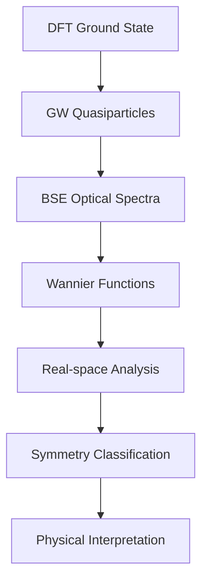

# Software Implementation Guide

## Overview

This section provides comprehensive documentation for the software tools and computational implementations that make up the QuREX ecosystem. The software framework combines established first-principles codes with innovative analysis tools to enable cutting-edge research in excitonic materials.

## Software Architecture

### Core Components

The QuREX software stack is built upon several interconnected components:

#### 1. **First-Principles Engines**
- **[Yambo](yambo/yambo)**: Many-body perturbation theory calculations (GW, BSE)
- **Quantum ESPRESSO**: Ground-state DFT calculations
- **Wannier90**: Maximally localized Wannier functions
- **LetzElPhC**: Electron-phonon coupling calculations

#### 2. **Analysis and Post-Processing**
- **[Yambopy](https://github.com/rreho/yambopy)**: Python interface for Yambo data analysis
- **[ExcitonGroupTheory](exciton_group_theory_api)**: Symmetry analysis of excitonic states
- **Real-space analysis tools**: Wannier exciton visualization
- **Optical property calculators**: Absorption, emission, photoluminescence

#### 3. **Workflow Management**
- **Input generation**: Automated setup of complex calculations
- **Data management**: Efficient handling of large datasets
- **Visualization tools**: Interactive plotting and analysis
- **Integration scripts**: Seamless workflow between different codes

## Key Features

### 🔬 **Scientific Capabilities**
- **Multi-scale modeling**: From atoms to optical properties
- **Advanced many-body theory**: State-of-the-art GW+BSE calculations
- **Real-space analysis**: Wannier function-based exciton localization
- **Symmetry analysis**: Group theory classification of excitonic states
- **Electron-phonon coupling**: Temperature-dependent properties

### 💻 **Computational Efficiency**
- **Parallel computing**: MPI and OpenMP support
- **Memory optimization**: Efficient algorithms for large systems
- **GPU acceleration**: CUDA support for selected operations
- **Scalable architecture**: From laptops to supercomputers

### 🛠️ **User Experience**
- **Python integration**: Modern scripting and analysis environment
- **Comprehensive documentation**: Theory, tutorials, and API references
- **Example workflows**: Ready-to-use calculation templates
- **Community support**: Active development and user community

## Installation and Setup

### System Requirements

**Minimum Requirements:**
- Linux/Unix operating system
- Python 3.7 or higher
- Modern Fortran compiler (gfortran, ifort)
- MPI library (OpenMPI, Intel MPI)
- BLAS/LAPACK libraries

**Recommended Setup:**
- Multi-core CPU (8+ cores)
- 16+ GB RAM
- Fast storage (SSD recommended)
- GPU for accelerated calculations (optional)

### Installation Guide

Detailed installation instructions are provided for each component:

1. **[Yambo Installation](yambo/yambo#installation)**: Complete setup guide
2. **Yambopy Setup**: Python package installation and configuration
3. **Dependencies**: Required libraries and tools
4. **Testing**: Validation of installation

## Workflow Integration

### Typical Calculation Workflow

### Data Flow

The QuREX workflow involves several data transformation steps:

1. **DFT → GW**: Electronic structure corrections
2. **GW → BSE**: Excitonic effects inclusion
3. **BSE → Wannier**: Real-space transformation
4. **Wannier → Analysis**: Physical property extraction

## Performance and Scalability

### Benchmarking Results

Performance characteristics for typical systems:

| System Size | Atoms | Time (GW) | Time (BSE) | Memory |
|-------------|-------|-----------|------------|---------|
| Small       | <50   | 1-10 min  | 10-60 min  | 1-4 GB  |
| Medium      | 50-200| 1-6 hours | 2-12 hours | 4-16 GB |
| Large       | >200  | 6+ hours  | 12+ hours  | 16+ GB  |

### Optimization Strategies

- **Parallel efficiency**: Optimal core count selection
- **Memory management**: Efficient data structures
- **I/O optimization**: Fast file system utilization
- **Algorithm selection**: Method-specific optimizations

## Development and Contributing

### Open Source Philosophy

The QuREX software ecosystem embraces open-source development:

- **Collaborative development**: Community-driven improvements
- **Transparent methodology**: Open algorithms and implementations
- **Reproducible research**: Shareable workflows and data
- **Educational value**: Learning through code exploration

### Contributing Guidelines

We welcome contributions in various forms:

- **Code development**: New features and bug fixes
- **Documentation**: Improvements and additions
- **Testing**: Validation on new systems and materials
- **Examples**: Real-world use cases and tutorials

### Development Roadmap

**Short-term goals:**
- Enhanced GPU acceleration
- Improved memory efficiency
- Extended material support
- Better visualization tools

**Long-term vision:**
- Machine learning integration
- Cloud computing support
- Real-time analysis capabilities
- Advanced visualization interfaces

## Support and Community

### Getting Help

- **Documentation**: Comprehensive guides and references
- **Tutorials**: Step-by-step learning materials
- **Examples**: Working calculation templates
- **Community forums**: User discussions and support
- **Issue tracking**: Bug reports and feature requests

### Training and Education

- **Workshops**: Hands-on training sessions
- **Webinars**: Online learning opportunities
- **School programs**: Educational partnerships
- **Certification**: Proficiency validation

## Future Directions

### Emerging Technologies

The QuREX software framework continues to evolve with:

- **Quantum computing**: Hybrid classical-quantum algorithms
- **Machine learning**: AI-assisted analysis and prediction
- **High-throughput computing**: Automated material screening
- **Real-time experiments**: In-situ analysis capabilities

### Research Frontiers

Current development focuses on:

- **Novel materials**: 2D materials, heterostructures, topological systems
- **Extreme conditions**: High pressure, temperature, magnetic fields
- **Nonlinear optics**: Higher-order optical responses
- **Quantum phenomena**: Entanglement, coherence, many-body localization

---

*The QuREX software ecosystem represents a comprehensive solution for modern excitonic materials research, combining theoretical rigor with computational efficiency and user-friendly interfaces.*