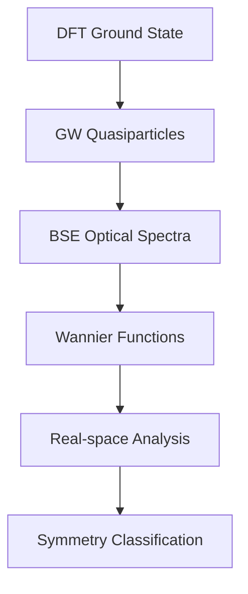

# Software Implementation

## Overview

This section documents the software tools and computational implementations in the QuREX ecosystem. The framework combines first-principles codes with analysis tools for excitonic materials research.

## Software Architecture

### Core Components

#### First-Principles Engines
- **[Yambo](yambo/yambo)**: Many-body perturbation theory (GW, BSE)
- **Quantum ESPRESSO**: Ground-state DFT calculations
- **Wannier90**: Maximally localized Wannier functions
- **LetzElPhC**: Electron-phonon coupling calculations

#### Analysis Tools
- **Yambopy**: Python interface for Yambo data analysis
- **[ExcitonGroupTheory](exciton_group_theory_api)**: Symmetry analysis of excitonic states
- **Real-space analysis**: Wannier exciton visualization
- **Optical calculators**: Absorption, emission, photoluminescence

#### Workflow Management
- Input generation and automated setup
- Data management for large datasets
- Visualization and interactive plotting
- Integration between different codes

## Installation

### System Requirements

**Minimum:**
- Linux/Unix operating system
- Python 3.7+
- Fortran compiler (gfortran, ifort)
- MPI library (OpenMPI, Intel MPI)
- BLAS/LAPACK libraries

**Recommended:**
- Multi-core CPU (8+ cores)
- 16+ GB RAM
- SSD storage
- GPU for acceleration (optional)

### Setup Guide

1. **[Yambo Installation](yambo/yambo#installation)**: Complete setup
2. **Yambopy Setup**: Python package installation
3. **Dependencies**: Required libraries
4. **Testing**: Installation validation

## Workflow Integration

### Calculation Workflow

### Data Flow

1. **DFT → GW**: Electronic structure corrections
2. **GW → BSE**: Excitonic effects inclusion
3. **BSE → Wannier**: Real-space transformation
4. **Wannier → Analysis**: Physical property extraction

## Performance

### Typical Performance

| System Size | Atoms | GW Time | BSE Time | Memory |
|-------------|-------|---------|----------|---------|
| Small       | <50   | 1-10 min| 10-60 min| 1-4 GB  |
| Medium      | 50-200| 1-6 hrs | 2-12 hrs | 4-16 GB |
| Large       | >200  | 6+ hrs  | 12+ hrs  | 16+ GB  |

### Optimization
- Parallel efficiency through optimal core selection
- Memory management with efficient data structures
- I/O optimization for fast file systems
- Method-specific algorithm optimizations

## Development

### Contributing

We welcome contributions:
- Code development and bug fixes
- Documentation improvements
- Testing on new systems
- Example workflows and tutorials

### Development Process

1. Fork repository
2. Develop features/fixes
3. Test thoroughly
4. Submit pull request
5. Code review and integration

## Support

### Getting Help
- Documentation and guides
- Step-by-step tutorials
- Working examples
- Community forums
- Issue tracking

### Training Resources
- Hands-on workshops
- Online webinars
- Educational partnerships
- Proficiency validation

## Future Development

### Current Focus
- Enhanced GPU acceleration
- Improved memory efficiency
- Extended material support
- Better visualization tools

### Research Applications
- 2D materials and heterostructures
- Extreme conditions (pressure, temperature)
- Nonlinear optical responses
- Quantum phenomena studies