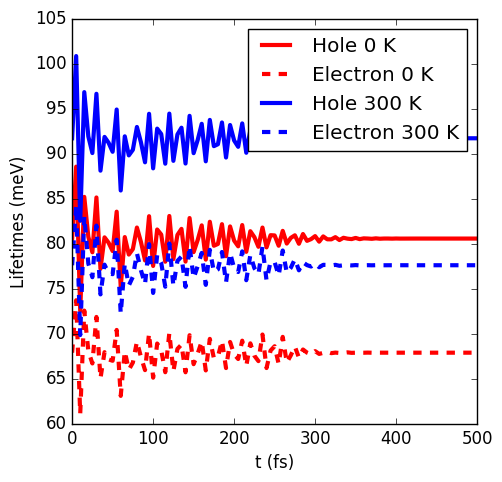
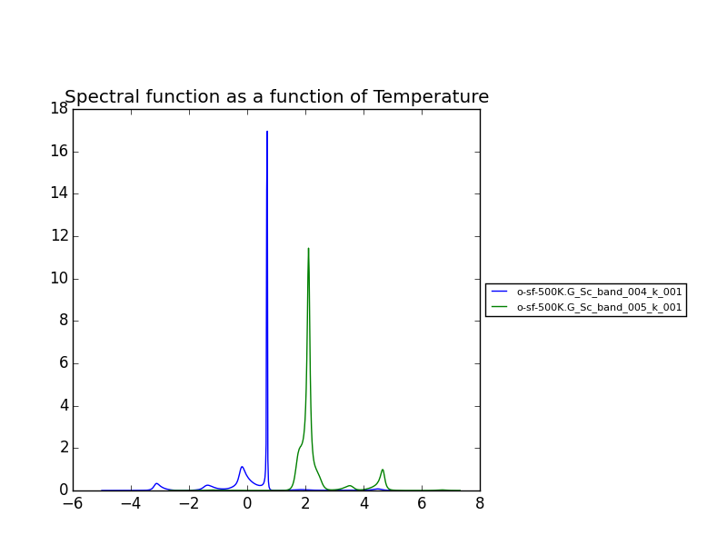

Real Time Simulations (Si)
---------------------------
**by A. Molina Sánchez**

We start with the calculation of the ground state properties using the script 
``gs_si.py`` in the ``tutorials/si`` folder.
We will create self-consistent data (folder ``scf``) and a non-self consistent 
data (folder ``nscf``). All the real-time calculations are realized
inside the folder ``rt``.

In order to perform real-time simulations we need to perform some preliminary steps:

    - Creating the files containing the electron-phonon matrix elements: We use 
      quantum espresso ('ph.x'). The grid used for obtaining the eletron-phonon 
      matrix elements must be the same than for the real-time simulations. 
      See in the `yambo website <http://www.yambo-code.org/>`_ more information about the methodology.

.. code-block:: bash

    python gkkp_si.py

The script will create a folder ``GKKP`` inside ``rt``. ``GKKP`` contains all the electron-phonon matrix elements in the
full Brillouin zone.

    - Breaking symmetries. The action of an external field breaks the symmetry of 
      the system. We need to break the symmetries according with the direction of 
      the polarization of the incident light. When we run for first time:

.. code-block:: bash

    python rt_si.py

``yambopy`` check if the ``SAVE`` exists inside ``rt``. If not, it breaks the symmetries. We can select linear or circular
polarized light. The light polarization must be the same along all the calculations. Here we select a field along x-axis:

.. code-block:: bash

    ypp['Efield1'] = [ 1, 0, 0]  # Field in the X-direction

The circular polarized field must be set as follows:

.. code-block:: bash

    ypp['Efield1'] = [ 1, 0, 0]  # Circular polarization
    ypp['Efield2'] = [ 0, 1, 0]

If everything is OK we have to find inside ``rt`` the folder ``SAVE`` and ``GKKP``. Now we can start the
real-time simulations. We discuss the following run levels.

**1. Collisions.**

.. code-block:: bash

    yambo -r -e -v c -V all

Calculation of the collisions files. This step is mandatory to run any real-time simulation. We calculate the
matrix elements related with the electronic correlation (see 
Ref. `PRB 84, 245110 (2011) <http://journals.aps.org/prb/abstract/10.1103/PhysRevB.84.245110>`_). We have
several choices for the potential approximation (we use COHSEX in this tutorial).

.. code-block:: bash

  run['HXC_Potential'] = 'COHSEX' # IP, HARTREE, HARTREE-FOCK, COHSEX

The variables for the collisions are very similar to a Bethe-Salpeter (BSE) run. First, we start calculating
the static dielectric function. It follows the calculation of the Kernel components for the 
electron-hole states of interest. In addition, we have several cutoffs 
to be set, in a similar way than in the case of the BSE.

.. code-block:: bash

  run['NGsBlkXs']  = [100,'mHa']  # Cut-off of the dielectric function
  run['BndsRnXs' ] = [1,30]       # Bands of the dielectric function
  run['COLLBands'] = [2,7]        # States participating in the dynamics.
  run['HARRLvcs']  = [5,'Ha']     # Hartree term: Equivalent to BSENGexx in the BSE run-level
  run['EXXRLvcs']  = [100,'mHa']  # Forck term:   Equivalent to BSENGBlk in the BSE run-level
  run['CORRLvcs']  = [100,'mHa']  # Correlation term: Not appearing in BSE. 

In general, we use the converged parameters of the BSE to set the 
variables of the collisions run. For parallel runs (see section for parallel advices) a common 
recipe is to parallelize only in k points.

**2. Time-dependent with a delta pulse.**

.. code-block:: bash

    yambo -q p 

The delta pulse real time simulation is the equivalent to the Bethe-Salpeter equation in the time domain (if we
use the COHSEX potential). We have to set the propagation variables: (i) time interval, (ii) duration of the
simulation, and (iii) integrator. We have also to set the intensity of the delta pulse.

.. code-block:: bash

    run['GfnQP_Wv']   = [0.10,0.00,0.00]    # Constant damping valence
    run['GfnQP_Wc']   = [0.10,0.00,0.00]    # Constant damping conduction

    run['RTstep']      = [ 100 ,'as']  # Interval
    run['NETime']      = [ 300 ,'fs']  # Duration
    run['Integrator']  = "RK2 RWA"     # Runge-Kutta propagation

    run['Field1_kind'] = "DELTA"          # Type of pulse 
    run['Field1_Int']  = [ 100, 'kWLm2']  # Intensity pulse

    run['IOtime']      = [ [0.050, 0.050, 0.100], 'fs' ]

The ``IOtime`` intervals specify the time interval to write (i) carriers, (ii) green's functions and (iii) output. In general,
we can set high values to avoid frequent IO and hence slow simulations. Only in the case where we need the
data to calculate the Fourier Transform (as in the case of the delta pulse, we set this variable to lower values). The constant
dampings ``GfnQP_Wv`` and ``GfnQP_Wc`` are dephasing constants, responsible of the decaying of the polarization. They are
the finite-time equivalent to the finite broadening of the Bethe-Salpeter solver (``BDmRange``).

A mandatory test to check if yambo_rt is running properly is to confront the BSE spectra with the obtained using yambo_rt (use the 
script kbe-spectra.py). Observe how the KBE spectra is identical to the BSE spectra except for intensities bigger than ``1E5``. Beyond
this value we are not longer in the linear response regime.

.. image:: figures/bse-kbe-intensity.png
   :height: 400px
   :width: 800 px
   :align: center

**3. Time-dependent with a gaussian pulse.**

.. code-block:: bash

    yambo -q p

The run-level is identical for that of the delta pulse. However, we have to set more variables related with the pulse kind. In order
to generate a sizable amount of carriers, the pulse should be centered at the excitonic peaks (obtained from the delta pulse spectra).
The damping parameter determines the duration of the pulse. We can also chose linear or circular polarization (see later
the section for circular polarization). Be aware of setting the duration of the simulation accordingly with the duration of the pulse.

.. code-block:: bash

    run['Field1_kind'] = "QSSIN"
    run['Field1_Damp'] = [  50,'fs']         # Duration of the pulse
    run['Field1_Freq'] = [[2.3,2.3],'eV']    # Excitation frequency 
    run['Field1_Int']  = [ 1, 'kWLm2']       # Intensity pulse

In general, for any pulse create a population of carriers (electron-holes). One sign that simulation is running well is that the number
of electrons and holes is the same during all the simulation. Below we show the typical output for a simulation of a gaussian pulse, the number of
carriers increases until the intensity of the pulse becomes zero.

Besides the delta and gaussian pulse we can use others as the sin pulse. Below we have a brief summary of the three pulses, showing the
external field and the number of carriers. Observe than the sinusoidal pulse is active along all the simulation time, therefore we are always creating carriers. After certain time the number of electrons will exceed the charge acceptable in a simulation of linear response. The polarization follows the field. In the case of the delta pulse, we see a zero-intensity field and a constant number of carriers. Thus, the pulse is only active at the initial time and afterwards the polarization decays due to the the finite
lifetime given by ``GfnQP_Wv`` and ``GfnQP_Wc``. 

**4. Time-dependent with a gaussian pulse and dissipation**

The Kadanoff-Baym equation implemented in yambo includes dissipation mechanisms such as (i) electron-phonon scattering, (ii) electron-electron
scattering and (iii) electron-photon scattering. In the following subsections we use a gaussian pulse with the parameters given above.

**4.1 Electron-phonon interaction**

.. code-block:: bash

   yambo -q p -s p

In order to include electron-phonon dissipation, previously we need to create the electron-phonon matrix elements. We call the script
``gkkp_sii.py``. We can check

.. code-block:: bash

    python gkkp_si.py

This script runs QE to calculate the matrix elements and then ``ypp_ph`` to convert them to the ``yambo`` format. If everything is right
we find a folder call ``GKKP`` inside ``rt``. ``GKKP`` contains all the electron-phonon matrix elements in the
full Brillouin zone. The variables related to the dissipation are

.. code-block:: bash

    run['LifeExtrapSteps'] = [ [1.0,1.0], 'fs' ]
    run['BoseTemp']        = [ 0, 'K']
    run['ElPhModes']       = [ 1, 9]
    run.arguments.append('LifeExtrapolation')     # If commented:   Lifetimes are constant

The variable ``LifeExtrapSteps`` sets the extrapolation steps to calculate the electron-phonon lifetimes. If commented, lifetimes are assumed
constants. We can set the lattice temperature with ``BoseTemp`` and the number of modes entering in the simulation ``ElPhModes``. In order
to account of the temperature effects in a realistic ways the electron and hole damping ``GfnQP_Wv`` and ``GfnQP_Wc`` should be update for 
each temperature run. In most semiconductors, they are proportional to the electronic density of states. The second element of the array
multiply the density of states by the given values. For instance, we could set:

.. code-block:: bash

    run['GfnQP_Wv']   = [0.00,0.10,0.00]    # Constant damping valence
    run['GfnQP_Wc']   = [0.00,0.10,0.00]    # Constant damping conduction

Below we show the carrier dynamics simulation including the electron-phonon dissipation of electrons and holes. We have made the example for two different
temperatures. We only show the lifetimes of electrons and holes for 0 and 300 K. At each time step we show the mean value of the electron-phonon lifetime. We can observe
that increases for larger temperature (see the Electron-phonon tutorial). Moreover, when the systems tends to the final state the mean EP lifetimes reachs a constant value.

**4.2 Electron-electron interaction**

.. code-block:: bash

   yambo -q p -s e

The inclusion of the electron-electron scattering needs the calculation of the electron-electron collisions files.

**5. Use of Double-Grid in carrier dynamics simulation**

The convergence of the results with the k-grid is a delicate issue in carrier dynamics simulations. In order to mitigate the
simulation time we can use a double-grid. In our example we create the double-grid in three steps.

(i) We run a non-self-consistent simulation for a larger grid (``4x4x4`` in the silicon example). We find the results in the folder **nscf-dg**.

(ii) We break the symmetries accordingly with our polarization field using the scripts. We indicate the output folder **rt-dg**, the prefix **si** and the polarization **100**.

.. code-block:: bash

   python break-symm.py -i nscf-dg -o rt-dg -p si -s 100

(iii) We have created the script `map-symm.py` to map the coarse grid in the fine grid.

.. code-block:: bash

   python map-symm.py -i rt-dg -o rt dg-4x4x4 

The folder **dg-4x4x4** is inside the **rt** folder. We will find a netCDF file ``ndb.Double_Grid``. In order to tell yambo to read the Double-grid we
have to indicate the folder name inside the ``-J`` option. In our example

.. code-block:: bash

   yambo_rt -F 04_PUMP -J 'qssin,col-hxc,dg-4x4x4'

We can activate the double-grid in the python script `rt_si.py` by selecting:

.. code-block:: bash

   job['DG'] = (True,'dg-4x4x4')

We can also check if yambo is reading correctly the double-grid in the report file. We have to find the lines:

.. code-block:: bash

  [02.05] Double K-grid
    =====================

  K-points             : 103
  Bands                :  8

Electron-Phonon interaction (Si)
---------------------------------
**by A. Molina Sánchez**

**1. Ground State and non-self consistent calculation**

Electron-phonon interaction calculations requires to obtain electronic states, phonon states and the 
interaciton between them. An extended study can be found in the  `Thesis of Elena Cannuccia 
<http://www.yambo-code.org/papers/Thesis_Elena_Cannuccia.pdf>`_.

Go to the ``tutorial`` folder and run the ground state calculation using the ``gs_si.py`` file:

.. code-block:: bash

    python gs_si.py

The script will run a relaxation of the structure, read the optimized cell parameter and create a new input file that is used
to run a self-consistent (scf) cycle and a non self-consistent (nscf) cycle using the charge density calculated on the previous run.

The self-consistent data are used to obtain the derivative of the potential. The non-self-consistent data are used, together with the
potential derivative, for deriving the electron-phonon matrix elements.

.. image:: figures/tutorial-el-ph_1.jpg

The script ``elph_pw_si.py`` calculates the electron-phonon matrix elements. It follows the indications of the flowchart, using
the scf and nscf data. All the files used by QE are stored in the directory ``work``. Finally, it transform the files from
the QE format to the netCDF format used by yambo. It creates the folder ``elphon``.

**2. Electron-phonon calculations**

The second step requires the script ``elph_qp_si.py``. If the electron-phonon matrix elements have been successfully created and
stored in ``elphon/SAVE`` we are ready to calculate the electron-phonon correction of the eigenvalues at several temperatures, 
or to examine the spectral function of each quasi-particle state. A detailed tutorial of the capabilities of the module electron-phonon
of yambo is also available in the `yambo electron-phonon tutorial <http://www.yambo-code.org/tutorials/Electron_Phonon/index.php>`_.

If we run:

.. code-block:: bash
   
    python elph_qp_si.py -r

Yambo will calculate the quasi-particle correction and the spectral functions for the top of the valence band and the 
bottom of the conduction band (states 4 and 5). In order to plot the results we type:

.. code-block:: bash
   
    python elph_qp_si.py -p

The QP correction due to the electron-phonon interaction are usually much smaller than those obtained with the GW approximation.

.. image:: figures/elph-qp-correction.png

We can also plot the spectral function for a given state (n,k), i. e., the imaginary part of the Green's function. This is a useful check of
the validity of the QP approximation. A well-defined QP state will show a single-peak spectral function (or a clearly predominant one). A recent
application in single-layer MoS2 is available here.

We can play with more options by selecting the appropiate variables from the script ``elph_qp_si.py``. For instance we can: (i) select only
the Fan or Debye-Waller term, (ii) calculation on the on-mass-shell approximation, (iii) print the Eliashberg functions, etc.
