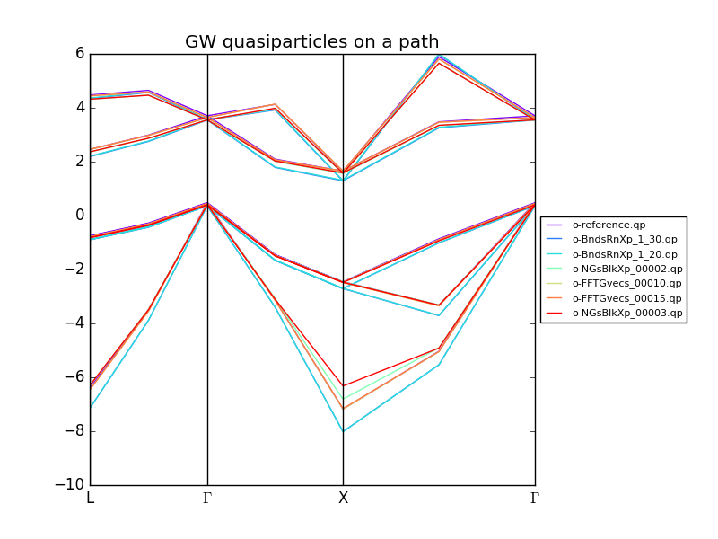
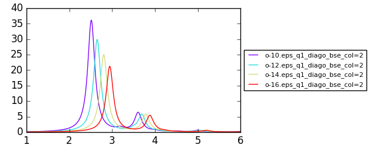
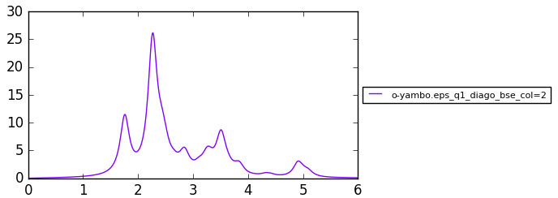
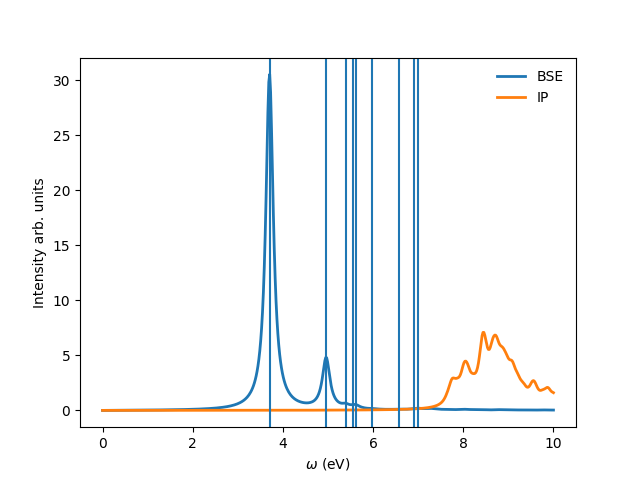
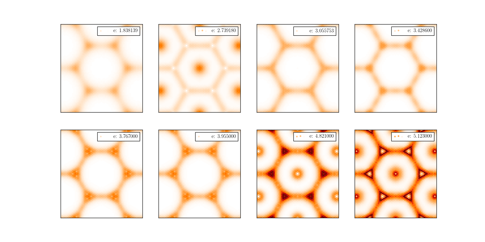
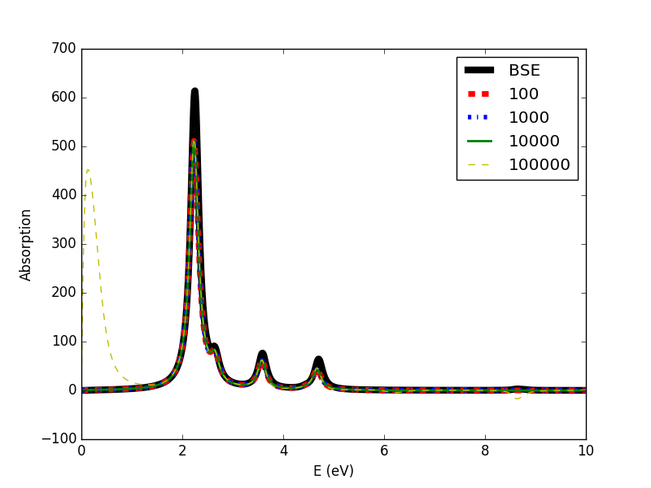
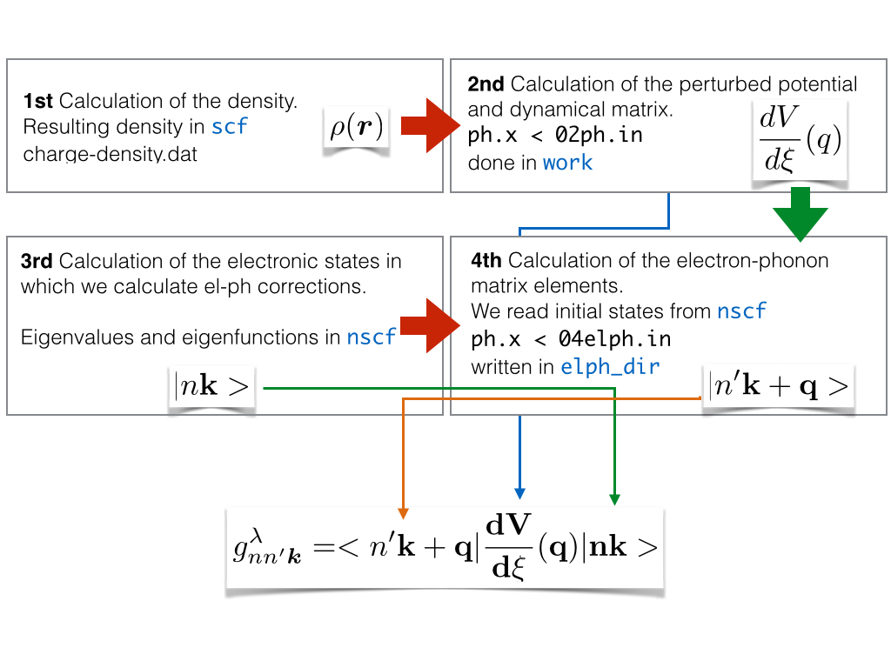
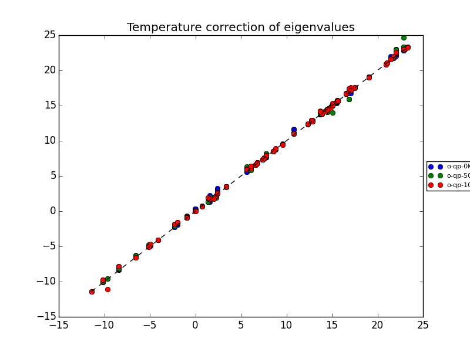
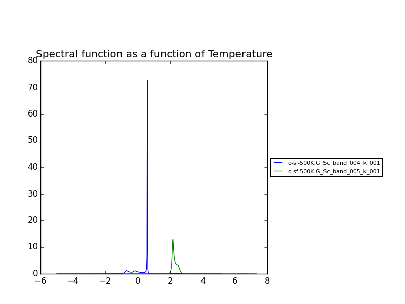

Tutorial
==========

In the ``tutorial`` folder you can find some examples of how to get started using ``yambopy``.
The first step in any calculation with ``yambo`` is to calculate the ground state proprieties using either ``abinit`` or ``pw.x``.
We don't have support to read and write ``abinit`` input files. To do that you should use the `abipy <https://github.com/gmatteo/abipy>`_ package.
Included in the ``yambopy`` package we include some basic scripts to generate Quantum Espresso input files.

GW convergence (Si)
--------------------
**by H. Miranda**

**1. Ground State**

Go to the ``tutorial`` folder and run the ground state calculation using the ``gs_si.py`` file:

.. code-block:: bash

    python gs_si.py
    python gs_si.py -r -s -n

When you run the script without any arguments it will display the available options.
The second line will run a relaxation of the structure (-r, relax option), read the optimized cell parameter and create a new input file that is used
to run a self-consistent (-s, --scf option) cycle and a non self-consistent (-n, --nscf option) cycle using the charge density calculated on the previous run.

**2. GW convergence**

Afterwards you can run a GW calculation using the ``gw_si.py`` script and a Bethe-Salpether (BSE) calculation using the ``bse_si.py``.
In the beginning of each script (for GW or BSE) there is a check for the presence of the SAVE database. In case it is not present it will be generated.

In the ``gw_conv_si.py`` you will find an example of how to use the ``optimize()`` function to converge the calculation parameters.

.. code-block:: python

    #create the yambo input file
    y = YamboIn('%s -d -g n -V all'%yambo,folder='gw_conv')
    y['QPkrange'][0][2:4] = [6,10]
    conv = { 'FFTGvecs': [[10,15,20],'Ry'],
             'NGsBlkXd': [[1,2,5], 'Ry'],
             'BndsRnXd': [[1,10],[1,20],[1,30]] }

    def run(filename):
        """ Function to be called by the optimize function """
        folder = filename.split('.')[0]
        print(filename,folder)
        os.system('cd gw_conv; yambo -F %s -J %s -C %s 2> %s.log'%(filename,folder,folder,folder))

    y.optimize(conv,run=run)

This code will run ``yambo`` as many times as variables specified in the ``conv`` dictionary.
The first calculation is called ``reference`` and uses as parameters the first element of each of the lists.
For each of the other elements of the list a calculation is made.

**3. Collect the data**

Once all the calculations are finished it's time to pack all the files in the ``json`` format for posterior analysis.
For this use the ``YamboOut()`` class:

.. code-block:: python

  #pack the files in .json files
  for dirpath,dirnames,filenames in os.walk('gw_conv'):
    #check if there are some output files in the folder
    if ([ f for f in filenames if 'o-' in f ]):
        y = YamboOut(dirpath,save_folder=dirpath)
        y.pack()

This snippet of code can be called using the function:

.. code-block:: python

    pack_files_in_folder('gw_conv',save_folder='gw_conv')

**4. Plot the data**

After this you should have a set of ``json`` files in the folder, one for each calculation.
To make a plot of them all you just need to run:

.. code-block:: python

  #plot the results using yambo analyser
  y = YamboAnalyser('gw_conv')
  y.plot_gw('qp')
  path = [[[0.5,   0,   0],'L'],
          [[  0,   0,   0],'$\Gamma$'],
          [[  0, 0.5, 0.5],'X'],
          [[1.0, 1.0, 1.0],'$\Gamma$']]
  ya.plot_gw_path('qp',path)

You can add more plots by simply adding more files in the folder you give as input to the ``YamboAnalyser()`` class.
At the end you should obtain a plot like this:

Coulomb-cutoff (BN)
-------------------------------
**by H. Miranda**

In this example we will test the convergence of the coulomb truncation for a BSE calculation in single layer Boron Nitride.
For that we define a loop where we perform a self-consistent ground state calculation, non self-consistent calculation, create the databases
and run ``yambo`` with increasing vacuum and plot the absorption spectra.

**2. Coulomb truncation convergence**

In the folder ``tutorials/bn/`` you find the python script ``bse_cutoff.py``.
You can run this script with:

.. code-block:: bash

    python bse_cutoff.py -r

The main loop changes the ``layer_separation`` variable using values from a list.
In the script you can find how the functions ``scf``, ``ncf`` and ``database`` are defined.

.. code-block:: python

    #for each separation run the ground state calculation and
    for layer_separation in layer_separations:

      root_folder = "%s/%d"%(work_folder,layer_separation)
      if not os.path.isdir(root_folder):
          os.makedirs(root_folder)

      # run the ground state calculation
      print("scf cycle")
      scf(layer_separation,folder="%s/scf"%root_folder)
      os.system("cd %s/scf; pw.x < %s.scf > scf.log"%(root_folder,prefix))

      # run the non self consistent calculation
      print("nscf cycle")
      src ='%s/scf/%s.save'%(root_folder,prefix)
      dst ='%s/nscf/%s.save'%(root_folder,prefix)
      nscf(layer_separation,folder="%s/nscf"%root_folder)
      os.system( 'cp -r %s %s'%(src,dst) )
      os.system("cd %s/nscf; pw.x < %s.nscf > nscf.log"%(root_folder,prefix))

      # generate the database
      database('%s'%root_folder,nscf_folder="%s/nscf"%root_folder)

      # calculate the absorption spectra using yambo
      y = YamboIn('yambo -r -b -o b -k sex -y d -V all',folder=root_folder)

      y['FFTGvecs'] = [30,'Ry']
      y['NGsBlkXs'] = [1,'Ry']
      y['BndsRnXs'] = [1,30]

      y['CUTGeo'] = 'box z'
      y['CUTBox'] = [0,0,layer_separation-1]

      y['KfnQP_E']  = [1.0,1.0,1.0] #scissor operator
      y['BSEBands'] = [3,6]
      y['BEnSteps'] = 500
      y['BEnRange'] = [[1.0,6.0],'eV']
      y.write('%s/yambo_run.in'%root_folder)
      os.system('cd %s; %s -F yambo_run.in -J %d'%(root_folder,yambo,layer_separation))

**3. Plot the convergence**

You can plot the results using:

.. code-block:: bash

    python bse_cutoff.py -p

You should obtain a plot like this:

Parallel Bethe-Salpeter (MoS\ :sub:`2`)
-----------------------------------------------------------------
**by H. Miranda**

.. warning::
    The ``merge_eps.py`` gathers the dielectric function databases into one folder with the correct numeration.
    This script should be used in versions of ``yambo`` that create one file ``ndb.em1*_fragment_1`` per folder.
    In the next version of ``yambo`` the files will already have the correct numeration so you just need to collect all the files.

In this tutorial we will show how you can parallelize the dielectric function calculation in
separate jobs for a BSE optical absorption spectra calculation.

The idea is that in certain clusters its advantageous to split the dielectric function calculation
in smaller jobs (one for each q-point) that can run at the same time.
Using the ``yambo`` parallelization you can separate the dielectric function calculation among many cpus
using the variable ``q`` in ``X_all_q_CPU`` and ``X_all_q_ROLEs``. The issue is that you still need to make a big reservation
and in some cases there is load imbalance (some nodes end up waiting for others). Splitting in smaller jobs
can help your jobs to get ahead in the queue and avoid the load imbalance.
If there are many free nodes you might end up running all the q-points at the same time.

**The idea is quite simple:** you create an individual input file for each q-point, submit each job separately, collect
the results and do the final BSE step (this method should also apply for a GW calculation).

**1. Ground State**

The ground state calculation for MoS\ :sub:``2`` is made in a similar fashion as the previous examples.
If some of the steps are already calculated you can tell the script not to run them using for example:

.. code-block:: bash

    python gs_mos2.py -n2

The option ``-n2`` will tell the script not to run the double grid ``nscf`` calculation.

**2. Parallel Dielectric function**

Here we tell ``yambo`` to calculate the dielectric function. We read the number of q-points the system has
and generate one input file per q-point. Next we tell ``yambo`` to calculate the first q-point. ``Yambo`` will calculate the dipoles
and the dielectric function at the first q-point.
Once the calculation is done we copy the dipoles to the SAVE directory. After that we can run each q-point calculation
as a separate job.
Here the user can decide to submit one job per q-point on a cluster or use a program like
`gnuparallel <http://www.gnu.org/software/parallel/>`_ to schedule the jobs according to the
available resources. In this example we use the second option.

.. code-block:: python

    #create the yambo input file
    y = YamboIn('yambo -r -b -o b -V all',folder='bse_par')
    y['FFTGvecs'] = [15,'Ry']
    y['NGsBlkXs'] = [1,'Ry']
    y['BndsRnXs'] = [[1,40],'']
    y.write('bse_par/yambo_run.in')

    #get the number of q-points
    _,nkpoints = y['QpntsRXs'][0]

    #prepare the q-points input files
    f = open('jobs.sh','w')
    for nk in xrange(1,int(nkpoints)+1):
        y['QpntsRXs'] = [[nk,nk],'']
        y.write('bse_par/yambo_q%d.in'%(nk))
        if nk != 1:
            f.write('cd bse_par; %s -F yambo_q%d.in -J %d\n'%(yambo,nk,nk))
    f.close()

    #calculate first q-point and dipoles
    os.system('cd bse_par; %s -F yambo_q1.in -J 1'%yambo)
    #copy dipoles to save
    os.system('cp bse_par/1/ndb.dip* bse_par/SAVE')
    #run jobs using gnuparallel
    os.system('parallel :::: jobs.sh')

**3. BSE**

Once the dielectric function is calculated its time to collect the data in one folder and
do the last step of the calculation: generate the BSE Hamiltonian, diagonalize it and
calculate the absorption.

.. code-block:: python

    #gather all the files
    os.system('cp merge_eps.py bse_par')
    os.system('cd bse_par; python merge_eps.py')

    y = YamboIn('yambo -r -b -o b -k sex -y d -V all',folder='bse_par')
    y['FFTGvecs'] = [15,'Ry']
    y['NGsBlkXs'] = [1,'Ry']
    y['BndsRnXs'] = [[1,40],'']
    y['BSEBands'] = [8,11]
    y['BEnSteps'] = 500
    y['BEnRange'] = [[1.0,6.0],'eV']
    y.arguments.append('WRbsWF')

    y.write('bse_par/yambo_run.in')
    os.system('cd bse_par; %s -F yambo_run.in -J yambo'%yambo)

**3. Collect and plot the results**

You can plot the data much in the same way as you did for the GW calculation.

.. code-block:: python

    #collect the data
    pack_files_in_folder('bse_par')

    #plot the results using yambo analyser
    y = YamboAnalyser('bse_par')
    y.plot_bse('eps')

You should obtain a plot like this:

Excitonic wavefunctions (BN)
-----------------------------------------------------------------
**by H. Miranda**

In this example we show how to use the ``yambopy`` to plot the excitonic wavefunctions that result from a BSE calculation.
Beaware the parameters of the calculation are not high enough to obtain a converged calculation. To run the calculation do:

.. code-block:: bash

    python gs_bn.py -s -n
    python bse_bn.py -r

Afterwards you can run a basic analysis of the excitonic states and store the wavefunctions of the ones 
that are more optically active and plot their wavefunctions in reciprocal space. Plots in real space are also possible
using yambopy but won't be treated here. In the analysis code you have:

.. code-block:: python

    #get the absorption spectra
    a = YamboBSEAbsorptionSpectra('yambo',save='bse/SAVE',path='bse')
    excitons = a.get_excitons(min_intensity=0.0005,max_energy=6,Degen_Step=0.01)
    print( "nexcitons: %d"%len(excitons) )
    print( "excitons:" )
    print( excitons )
    a.get_wavefunctions(Degen_Step=0.01,repx=range(-1,2),repy=range(-1,2),repz=range(1))
    a.write_json()
    
The class ``YamboBSEAbsorptionSpectra()`` reads the absoprtion spectra obtained with explicit diagonalization of the
BSE matrix. ``yambo`` if the ``job_string`` identifier used when running yambo, ``bse`` is the name of the folder where the job was run.
The function ``get_excitons()`` runs ``ypp`` to obtain the exitonic states and their intensities.
The function ``get_wavefunctions()`` also calls ``ypp`` and reads the
reciprocal (and optionally real space) space wavefunctions and finally we store all the data in a ``json`` file.

This file can then be easily ploted with another python script.
To run this part of the code you can do:

.. code-block:: bash

    python bse_bn.py -a
    python plot_excitons.py
    
You should then obtain plots similiar (these ones were generated on a 30x30 kpoint grid) to the figures presented here:

Again beaware this figures serve only to show the kind of representation 
that can be obtained with ``yambo`` and ``yambopy``. Further convergence tests need to be performed to obtain
accurate results, but that is left to the user.

Some plots of excitonic wavefunctions in real space are show in a parallel project in:
`http://henriquemiranda.github.io/excitonwebsite/ <http://henriquemiranda.github.io/excitonwebsite/>`_ 

Real Time Simulations (Si)
---------------------------
**by A. Molina Sánchez**

We start with the calculation of the ground state properties using the script 
``gs_si.py`` in the ``tutorials/si`` folder.
We will create self-consistent data (folder ``scf``) and a non-self consistent 
data (folder ``nscf``). All the real-time calculations are realized
inside the folder ``rt``.

In order to perform real-time simulations we need to perform some preliminary steps:

    - Creating the files containing the electron-phonon matrix elements: We use 
    quantum espresso ('ph.x'). The grid used for obtaining the eletron-phonon 
    matrix elements must be the same than for the real-time simulations. 
    See in the `yambo website <http://www.yambo-code.org/>`_ more information about the methodology.

.. code-block:: bash

    python gkkp_si.py

The script will create a folder ``GKKP`` inside ``rt``. ``GKKP`` contains all the electron-phonon matrix elements in the
full Brillouin zone.

    - Breaking symmetries. The action of an external field breaks the symmetry of 
    the system. We need to break the symmetries according with the direction of 
    the polarization of the incident light. When we run for first time:

.. code-block:: bash

    python rt_si.py

``yambopy`` check if the ``SAVE`` exists inside ``rt``. If not, it breaks the symmetries. We can select linear or circular
polarized light. The light polarization must be the same along all the calculations. Here we select a field along x-axis:

.. code-block:: bash

    ypp['Efield1'] = [ 1, 0, 0]  # Field in the X-direction

The circular polarized field must be set as follows:

.. code-block:: bash

    ypp['Efield1'] = [ 1, 0, 0]  # Circular polarization
    ypp['Efield2'] = [ 0, 1, 0]

If everything is OK we have to find inside ``rt`` the folder ``SAVE`` and ``GKKP``. Now we can start the
real-time simulations. We discuss the following run levels.

**1. Collisions.**

.. code-block:: bash

    yambo -r -e -v c -V all

Calculation of the collisions files. This step is mandatory to run any real-time simulation. We calculate the
matrix elements related with the electronic correlation (see 
Ref. `PRB 84, 245110 (2011) <http://journals.aps.org/prb/abstract/10.1103/PhysRevB.84.245110>`_). We have
several choices for the potential approximation (we use COHSEX in this tutorial).

.. code-block:: bash

  run['HXC_Potential'] = 'COHSEX' # IP, HARTREE, HARTREE-FOCK, COHSEX

The variables for the collisions are very similar to a Bethe-Salpeter (BSE) run. First, we start calculating
the static dielectric function. It follows the calculation of the Kernel components for the 
electron-hole states of interest. In addition, we have several cutoffs 
to be set, in a similar way than in the case of the BSE.

.. code-block:: bash

  run['NGsBlkXs']  = [100,'mHa']  # Cut-off of the dielectric function
  run['BndsRnXs' ] = [1,30]       # Bands of the dielectric function
  run['COLLBands'] = [2,7]        # States participating in the dynamics.
  run['HARRLvcs']  = [5,'Ha']     # Hartree term: Equivalent to BSENGexx in the BSE run-level
  run['EXXRLvcs']  = [100,'mHa']  # Forck term:   Equivalent to BSENGBlk in the BSE run-level
  run['CORRLvcs']  = [100,'mHa']  # Correlation term: Not appearing in BSE. 

In general, we use the converged parameters of the BSE to set the 
variables of the collisions run. For parallel runs (see section for parallel advices) a common 
recipe is to parallelize only in k points.

**2. Time-dependent with a delta pulse.**

.. code-block:: bash

    yambo -q p 

The delta pulse real time simulation is the equivalent to the Bethe-Salpeter equation in the time domain (if we
use the COHSEX potential). We have to set the propagation variables: (i) time interval, (ii) duration of the
simulation, and (iii) integrator. We have also to set the intensity of the delta pulse.

.. code-block:: bash

    run['GfnQP_Wv']   = [0.10,0.00,0.00]    # Constant damping valence
    run['GfnQP_Wc']   = [0.10,0.00,0.00]    # Constant damping conduction

    run['RTstep']      = [ 100 ,'as']  # Interval
    run['NETime']      = [ 300 ,'fs']  # Duration
    run['Integrator']  = "RK2 RWA"     # Runge-Kutta propagation

    run['Field1_kind'] = "DELTA"          # Type of pulse 
    run['Field1_Int']  = [ 1000, 'kWLm2'] # Intensity pulse

    run['IOtime']      = [ [0.050, 0.050, 0.100], 'fs' ]

The ``IOtime`` intervals specify the time interval to write (i) carriers, (ii) green's functions and (iii) output. In general,
we can set high values to avoid frequent IO and hence slow simulations. Only in the case where we need the
data to calculate the Fourier Transform (as in the case of the delta pulse, we set this variable to lower values). The constant
dampings ``GfnQP_Wv`` and ``GfnQP_Wc`` are dephasing constants, responsible of the decaying of the polarization. They are
the finite-time equivalent to the finite broadening of the Bethe-Salpeter solver (``BDmRange``).

A mandatory test to check if yambo_rt is running properly is to confront the BSE spectra with the obtained using yambo_rt (use the 
script kbe-spectra.py). Observe how the KBE spectra is identical to the BSE spectra except for intensities bigger than ``1E5``. Beyond
this value we are not longer in the linear response regime.

**3. Time-dependent with a gaussian pulse.**

.. code-block:: bash

    yambo -q p

The run-level is identical for that of the delta pulse. However, we have to set more variables related with the pulse kind. In order
to generate a sizable amount of carriers, the pulse should be centered at the excitonic peaks (obtained from the delta pulse spectra).
The damping parameter determines the duration of the pulse. We can also chose linear or circular polarization (see later
the section for circular polarization). Be aware of setting the duration of the simulation accordingly with the duration of the pulse.

.. code-block:: bash

    run['Field1_kind'] = "QSSIN"
    run['Field1_Damp'] = [  50,'fs']         # Duration of the pulse
    run['Field1_Freq'] = [[2.3,2.3],'eV']    # Excitation frequency 

In general, for any pulse create a population of carriers (electron-holes). One sign that simulation is running well is that the number
of electrons and holes is the same during all the simulation. Below we show the typical outputs for several kinds of pulses (DELTA, QSSIN and
SIN), like the polarization, number of carriers and pump intensity.

**4. Time-dependent with a gaussian pulse and dissipation**

The Kadanoff-Baym equation implemented in yambo includes dissipation mechanisms such as (i) electron-phonon scattering, (ii) electron-electron
scattering and (iii) electron-photon scattering. In the following subsections we use a gaussian pulse with the parameters given above.

**4.1 Electron-phonon interaction**

.. code-block:: bash

   yambo -q p -s p

In order to include electron-phonon dissipation, previously we need to create the electron-phonon matrix elements. We call the script
``gkkp_sii.py``. We can check

.. code-block:: bash

    python gkkp_si.py

This script runs QE to calculate the matrix elements and then ``ypp_ph`` to convert them to the ``yambo`` format. If everything is right
we find a folder call ``GKKP`` inside ``rt``. ``GKKP`` contains all the electron-phonon matrix elements in the
full Brillouin zone. The variables related to the dissipation are

.. code-block:: bash

    run['LifeExtrapSteps'] = [ [1.0,1.0], 'fs' ]
    run['BoseTemp']        = [ 0, 'K']
    run['ElPhModes']       = [ 1, 9]
    run.arguments.append('LifeExtrapolation')     # If commented:   Lifetimes are constant

The variable ``LifeExtrapSteps`` sets the extrapolation steps to calculate the electron-phonon lifetimes. If commented, lifetimes are assumed
constants. We can set the lattice temperature with ``BoseTemp`` and the number of modes entering in the simulation ``ElPhModes``. In order
to account of the temperature effects in a realistic ways the electron and hole damping ``GfnQP_Wv`` and ``GfnQP_Wc`` should be update for 
each temperature run. In most semiconductors, they are proportional to the electronic density of states. The second element of the array
multiply the density of states by the given values. For instance, we could set:

.. code-block:: bash

    run['GfnQP_Wv']   = [0.00,0.10,0.00]    # Constant damping valence
    run['GfnQP_Wc']   = [0.00,0.10,0.00]    # Constant damping conduction

**4.2 Electron-electron interaction**

.. code-block:: bash

   yambo -q p -s e

The inclusion of the electron-electron scattering needs the calculation of the electron-electron collisions files.

Electron-Phonon interaction (Si)
---------------------------
**by A. Molina Sánchez**

**1. Ground State and non-self consistent calculation**

Electron-phonon interaction calculations requires to obtain electronic states, phonon states and the 
interaciton between them. An extended study can be found in the  `Thesis of Elena Cannuccia 
<http://www.yambo-code.org/papers/Thesis_Elena_Cannuccia.pdf>`_.

Go to the ``tutorial`` folder and run the ground state calculation using the ``gs_si.py`` file:

.. code-block:: bash

    python gs_si.py

The script will run a relaxation of the structure, read the optimized cell parameter and create a new input file that is used
to run a self-consistent (scf) cycle and a non self-consistent (nscf) cycle using the charge density calculated on the previous run.

The self-consistent data are used to obtain the derivative of the potential. The non-self-consistent data are used, together with the
potential derivative, for deriving the electron-phonon matrix elements.

The script ``elph_pw_si.py`` calculates the electron-phonon matrix elements. It follows the indications of the flowchart, using
the scf and nscf data. All the files used by QE are stored in the directory ``work``. Finally, it transform the files from
the QE format to the netCDF format used by yambo. It creates the folder ``elphon``.

**2. Electron-phonon calculations**

The second step requires the script ``elph_qp_si.py``. If the electron-phonon matrix elements have been successfully created and
stored in ``elphon/SAVE`` we are ready to calculate the electron-phonon correction of the eigenvalues at several temperatures, 
or to examine the spectral function of each quasi-particle state. A detailed tutorial of the capabilities of the module electron-phonon
of yambo is also available in the `yambo website <http://www.yambo-code.org/tutorials/Electron_Phonon/index.php>`_.

H
If we run:

.. code-block:: bash
   
H
    python elph_qp_si.py -r

Yambo will calculate the quasi-particle correction and the spectral functions for the top of the valence band and the 
bottom of the conduction band (states 4 and 5). In order to plot the results we type:

.. code-block:: bash
   
    python elph_qp_si.py -p

The QP correction due to the electron-phonon interaction are usually much smaller than those obtained with the GW approximation.

We can also plot the spectral function for a given state (n,k), i. e., the imaginary part of the Green's function. This is a useful check of
the validity of the QP approximation. A well-defined QP state will show a single-peak spectral function (or a clearly predominant one). A recent
application in single-layer MoS2 is available here.

We can play with more options by selecting the appropiate variables from the script ``elph_qp_si.py``. For instance we can: (i) select only
the Fan or Debye-Waller term, (ii) calculation on the on-mass-shell approximation, (iii) print the Eliashberg functions, etc.
