Tutorial
==========

In the ``tutorial`` folder you can find some examples of how to get started using ``yambopy``.
The first step in any calculation with ``yambo`` is to calculate the ground state proprieties using either ``abinit`` or ``pw.x``.
We don't have support to read and write ``abinit`` input files. To do that you should use the `abipy <https://github.com/gmatteo/abipy>`_ package.
Included in the ``yambopy`` package we include some basic scripts to generate Quantum Espresso input files.

GW. Basic usage: Convergence and approximations (BN)
----------------------------------------------------
**by A. Molina-Sanchez and H. P. C. Miranda**

We have chosen hexagonal boron nitride to explain the use of yambopy. Along with this tutorial we show how to use yambopy to make efficient convergence tests, to compare different approximations and to analyze the results.

The initial step is the ground state calculation and the non self-consistent calculation using the ``gs_bn.py`` file:

.. code-block:: bash

    python gs_bn.py
    python gs_bn.py -sn

We have set the non-self-consistent run with a wave-function cutoff
of 60 Ry, 70 bands and a k-grid ``12x12x1``.
Open the file ``gs_bn.py`` and indentify where you can change the relevant parameters of your calculation.
These would be the ``get_inputfile`` to change the overall parameters and the ``scf`` for the self-consistent loop and ``nscf`` functions for the non-self consistent.

1. GW convergence
~~~~~~~~~~~~~~~~~~~~~~~~~~~~~~~~~~~~~~~~~~~~~~~~~~~~

We will now have a look at the ``gw_conv_bn.py`` in which all the steps we will mention during this tutorial have their own functions.

**(a) Calculations**

We converge the main parameters of a GW calculation independently.
We make use of the plasmon pole approximation for the dielectric function and the Newton solver to find the GW correction to the LDA eigenvalues.
The quantity to converge is the band gap of the BN (conduction and valence band at the K point of the Brillouin zone).
You can start the calculations using:

.. code-block:: bash

    python gw_conv_bn.py -c
    
While the calculations are running, take the time to have a look at what the script is doing by having a look at the source code ``gw_conv_bn.py`` and the explanation here.
We can start the input file for a GW calculation by calling the ``YamboIn`` with the right arguments:

.. code-block:: python

    y = YamboIn('yambo -d -g n -p p -V all',folder='gw_conv')

Find in the ``gw_conv_bn.py`` file the ``gw_convergence`` function where this line is defined.
The main variables for converging the GW calculation are:

    ``EXXRLvcs``: Exchange self-energy cutoff. Pay attention to the magnitue of this cut-off. The maximum value is the electronic-density cutoff from QE, which is larger than the wave-function cutoff (``ecutwfc``). 

    ``BndsRnXp``: Number of bands in the calculation of the dielectric function (PPA).
    ``NGsBlkXp``: Cutoff of the dielectric function.

    ``GbndRnge``: Self-energy. Number of bands.

The convergence with the k-grid is done after these variables are converged and in principle is also independent of them.
The convergence is set with a dictionary in which we choose the parameter and the values.
Be aware of setting the right units and format for each parameter.

.. code-block:: python

    conv = { 'EXXRLvcs': [[10,10,20,40,60,80,100],'Ry'],
             'NGsBlkXp': [[0,0,1,2,3], 'Ry'],
             'BndsRnXp': [[[1,10],[1,10],[1,15],[1,20],[1,30]]],''] ,
             'GbndRnge': [[[1,10],[1,10],[1,15],[1,20],[1,30]],''] }

The script will create a reference input file with the first value of each parameter and then create
input files with the other parameters changing according to the values specified in the list.
Note that when we converge a variable, let's say ``EXXRLvcs``, we set all the
other present in the dictionary to the given minimum value.
            
Be awared that some variables have a interdependence in the convergence and you
should double check that changing the value of a variable does not affect the
convergence of others.

The class ``YamboIn`` includes the function ``optimize``, which is called here:

.. code-block:: python

    y.optimize(conv,run=run,ref_run=False)

This optimization function just needs the convergence dictionary and the run instructions, given by the function:

.. code-block:: python

    def run(filename):
        """ Function to be called by the optimize function """
        folder = filename.split('.')[0]
        print(filename,folder)
        shell = bash() 
        shell.add_command('cd gw_conv; %s -F %s -J %s -C %s 2> %s.log'%(yambo,filename,folder,folder,folder))
        shell.run()
        shell.clean()

We set an interactive run, in the folder ``gw_conv``.
All the calculations will be made there with the corresponding jobname.

**(b) Analysis**

Once all the calculations are finished it's time to analyse them. Before we do that, let's look at the tools yambopy offers.

Yambopy uses the ``json`` format for posterior analysis of the results. To pack all the files in this format,
there is a recipe in yambopy to automatically perform this task on a folder:

.. code-block:: python

    pack_files_in_folder('gw_conv',save_folder='gw_conv')

Besides the python module, yambopy can also be called in the terminal to perform some post-analysis tasks:

.. code-block:: bash

    $ yambopy
             analysebse ->     Using ypp, you can study the convergence of BSE calculations in 2 ways:
               plotem1s ->     Plot em1s calculation
              analysegw ->     Study the convergence of GW calculations by looking at the change in band gap value.
                mergeqp ->     Merge QP databases
                   test ->     Run yambopy tests
           plotexcitons ->     Plot excitons calculation

Calling ``yambopy analysegw`` will display the help of the function:

.. code-block:: bash

    Study the convergence of GW calculations by looking at the change in band gap value.

    The script reads from <folder> all results from <variable> calculations and display them.

    Use the band and k-point options according to the size of your k-grid
    and the location of the band extrema.

        Mandatory arguments are:
            folder   -> Folder containing SAVE and convergence runs.
            var      -> Variable tested (e.g. FFTGvecs)

        Optional variables are:
            -bc, --bandc   (int)  -> Lowest conduction band number
            -kc, --kpointc (int)  -> k-point index for conduction band
            -bv, --bandv   (int)  -> Highest valence band number
            -kv, --kpointv (int)  -> k-point index for valence band
            -np, --nopack  (flag) -> Do not call 'pack_files_in_folder'
            -nt, --notext  (flag) -> Do not print a text file
            -nd, --nodraw  (flag) -> Do not draw (plot) the result

Running the function selecting the bands and kpoints, together with the parameter of convergence we will obtain the convergence plot.

.. code-block:: python

    yambopy analysegw -bc 5 -kc 19 -bv 4 -kv 19 gw_conv EXXRLvcs 
    yambopy analysegw -bc 5 -kc 19 -bv 4 -kv 19 gw_conv NGsBlkXp
    yambopy analysegw -bc 4 -kc 19 -bv 4 -kv 19 gw_conv BndsRnXp
    yambopy analysegw -bc 5 -kc 19 -bv 4 -kv 19 gw_conv GbndRnge

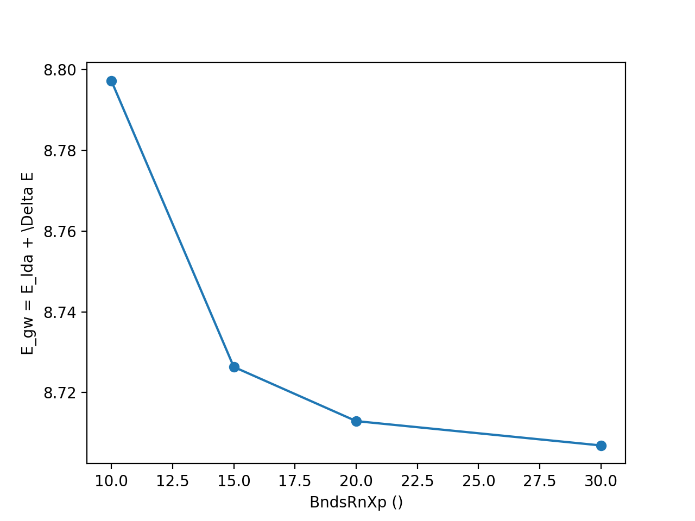
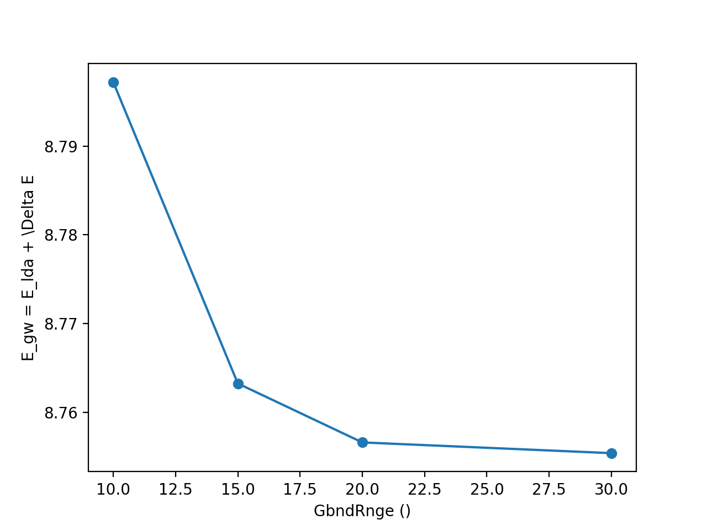

By calling ``python gw_conv_bn.py -p`` in the terminal, these steps will be performed automatically for this tutorial.

From the convergence plot we can choose now a set of parameters and repeat the calculation for finer k-grids until we reach convergence with the k-points. We have
intentionally used non-converged parameters. Nevertheless, along this week
you should have gotten enough expertise to push the convergence of the parameters
and determine the correct convergence set of parameters.
We invite you to enter in the python script, increase the parameters and check
again the convergence for larger values!

2. GW calculation on a regular grid and plot in a path in the Brillouin zone
~~~~~~~~~~~~~~~~~~~~~~~~~~~~~~~~~~~~~~~~~~~~~~~~~~~~~~~~~~~~~~~~~~~~~~~~~~~~~~~~~~~~~

We will work in the PPA for the screening. We have chosen the following parameters:

.. code-block:: python
    
    y = YamboIn('yambo -p p -g n -V all',folder='gw')

    y['EXXRLvcs'] = [80, 'Ry']
    y['BndsRnXp'] = [1,25]
    y['NGsBlkXp'] = [3, 'Ry']
    y['GbndRnge'] = [1,25]
    y['QPkrange'] = [1,19,2,6]

We can simply run the code to calculate the GW corrections for all the points of the Brillouin zone by setting the convergence parameters in the function gw of the script and doing:

.. code-block:: bash

   python gw_conv_bn.py -g

A clearer picture can be obtained by plotting the band structure along the symmetry points ``GMKG`` by using the analyser:

.. code-block:: bash

   python gw_conv_bn.py -r

The image will show all the GW energies along all the k-points of the Brillouin zone. 
We first pack the results in a json file and subsequently we use the analyser to create the object which contains all the information. 

.. code-block:: python
   
   pack_files_in_folder('gw')
   ya = YamboAnalyser('gw')

The object ``ya`` contains all the results written in the output. We can plot any output variable. In yambopy we provide a function to plot the band structure along a given path. The BN band structure is shown below. The GW correction opens the LDA band gap as expected.

3. Approximations of the dielectric function (COHSEX, PPA, Real axis integration)
~~~~~~~~~~~~~~~~~~~~~~~~~~~~~~~~~~~~~~~~~~~~~~~~~~~~~~~~~~~~~~~~~~~~~~~~~~~~~~~~~~~~~~~~~~~~~

We can use yambopy to examine different run levels. For instance, the approximations
used to obtain the screening are the:

    (i) Static screening or COHSEX

    (ii) Plasmon-pole approximation (PPA)

    (iii) Real axis integration. 

We have set the same parameters for each run, just changing the variable name
for the number of bands and the cut-off of the screening.

.. code-block:: python

    # COHSEX
    y = YamboIn('yambo -p c -g n -V all',folder='gw')
    y['BndsRnXs'] = [1,24]
    y['NGsBlkXs'] = [3,'Ry']

    # PPA (Plasmon Pole Approximation) 
    y = YamboIn('yambo -p p -g n -V all',folder='gw')
    y['BndsRnXp'] = [1,24]
    y['NGsBlkXp'] = [3,'Ry']

    # Real-Axis 
    y = YamboIn('yambo -d -g n -V all',folder='gw')
    y['BndsRnXd'] = [1,24]
    y['NGsBlkXd'] = [3,'Ry'] 

We have set the converged parameters and the function works by running:

.. code-block:: bash

   python gw_conv_bn.py -x

We plot the band structure using the analyzer explained above.

.. code-block:: bash

   python gw_conv_bn.py -xp

The PPA and the RA results are basically on top of each other. On the contrary, the COHSEX (static screening) makes a poor job, overestimating the bandgap correction.

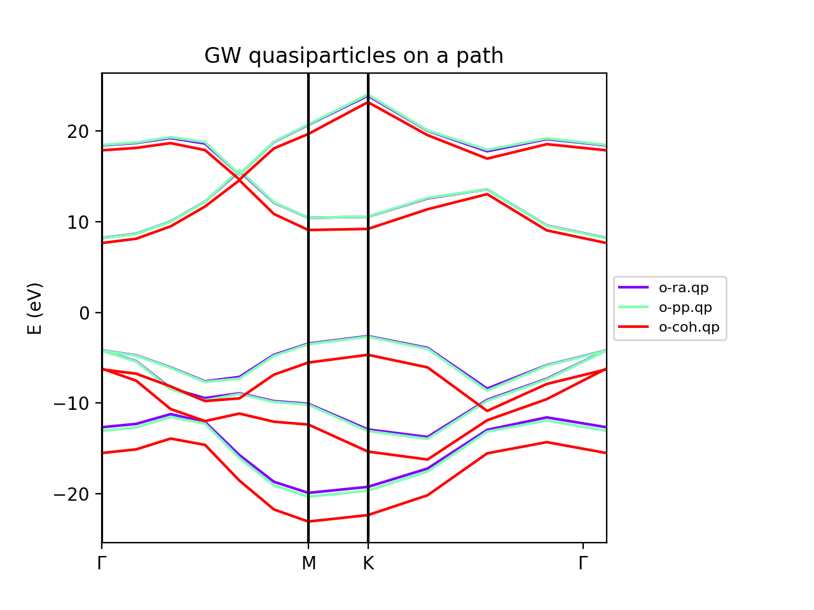

4. Solvers (Newton, Secant, Green's function)
~~~~~~~~~~~~~~~~~~~~~~~~~~~~~~~~~~~~~~~~~~~~~~~~~~~~~~~~~~~~~~~~~~

The solvers to find the QP correction from the self-energy can also be tested.
We have included the Newton and the secant method.
In the resulting band structures we do not appreciate big differences.
In any case it is worth to test during the convergence procedure.
To run the calculation using the different solvers use:

.. code-block:: bash

   python gw_conv_bn.py -z

Once the calculation is done, you can plot the results using:

.. code-block:: bash

   python gw_conv_bn.py -zp

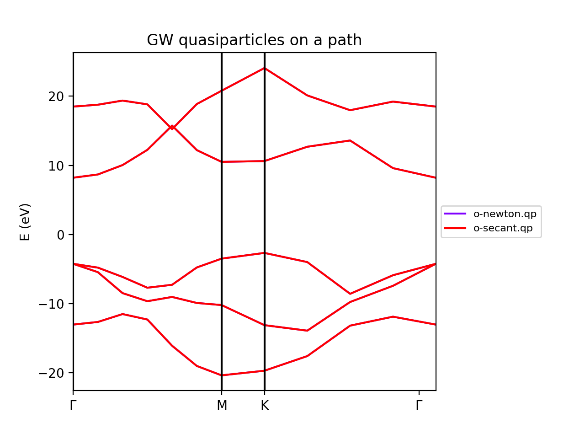

Optical absorption using the Bethe-Salpeter Equation (BN)
----------------------------------------------------------------------------
**by H. Miranda**

In this tutorial we will deal with different aspects of running a BSE calculation for
optical absorption spectra using yambopy:

    1. Relevant parameters for the convergence

        a. Static dielectric function
        b. Optical absorption spectra

    2. Coulomb truncation convergence 
    3. Plot excitonic wavefunctions
    4. Parallel static screening

Before you start this tutorial, make sure you did the scf and nscf runs.
If you did not, you can calculate the scf ``-s`` and nscf ``-n`` using the ``gs_bn.py`` file:

.. code-block:: bash

    python gs_bn.py -s -n

When that is done, you can start the tutorial.

1. Relevant parameters for the convergence
~~~~~~~~~~~~~~~~~~~~~~~~~~~~~~~~~~~~~~~~~~~~~~~~~~~~~~~~~~~~~~~~~~
In this section of the tutorial we will use the ``bse_conv_bn.py`` file.
To calculate the Bethe-Salpeter Kernel we need to first calculate the static dielectric screening and then the screened coulomb interaction matrix elements.
The relevant convergence parameters for these two stages are:

**a. Static dielectric function**

    ``FFTGvecs``: number of planewaves to include. Can be smaller than the number of planewaves in the self-consistency cycle. A typical good value is around 30 Ry (should always be checked!).

    ``BndsRnXs``: number of bands to calculate the screening. A very high number of bands is needed.

    ``NGsBlkXs``: number of components for the local fields. Averages the value of the dielectric screening over a number of periodic copies of the unit cell. This parameter increases greatly increases the cost of the calculation and hence should be increased slowly. A typical good value is 2 Ry.

To run the convergence we create a dictionary with different values for the variables.
The python script (``bse_conv_bn.py``) will create a reference input file with the first value of each parameter.
Then it will create input files with the other parameters changing according to the values specified in the list.

.. code-block:: python

    #list of variables to optimize the dielectric screening
    conv = { 'FFTGvecs': [[10,15,20,30],'Ry'],
             'NGsBlkXs': [[1,2,3,5,6], 'Ry'],
             'BndsRnXs': [[1,10],[1,20],[1,30],[1,40]] }

To run the convergence with the static dielectric function do:

.. code-block:: bash

    python bse_conv_bn.py -r -e

As you can see, the python script is running all the calculations changing the value of the input variables.
You are free to open the ``bse_conv_bn.py`` file and modify it accoridng to your own needs.
Using the optimal parameters, you can run a calculation and save the dielectric screening
databases ``ndb.em1s*`` to re-use them in the subsequent calculations.
For that you can copy these files to the SAVE folder. 
``yambo`` will only re-calculate any database if it does not find it
or some parameter has changed.

Once the calculations are done you can plot the static dielectric function as
a function of q points using the following commands:

.. code-block:: bash
    
    yambopy plotem1s bse_conv/FFTGvecs* bse_conv/reference
    yambopy plotem1s bse_conv/BndsRnXs* bse_conv/reference
    yambopy plotem1s bse_conv/NGsBlkXs* bse_conv/reference

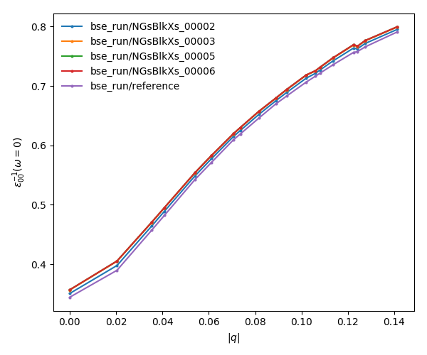

You are at this point invited to add new entries to the list of ``BndsRnXs`` in the convergence dictionary (keep it bellow or equal to the number of bands in the nscf calculation) re-run the script and plot the results again.

**b. Optical absorption spectra**

Once you obtained a converged dielectric screening function you can calculate the Bethe-Salpeter
auxiliary Hamiltonian and obtain the excitonic states and energies diagonalizing it or
calculating the optical absorption spectra with a recursive technique like the Haydock method.
Recall the relevant parameters for convergence:

    ``BSEBands``: number of bands to generate the transitions. Should be as small as possible as the size of the BSE auxiliary hamiltonian has (in the resonant approximation) dimensions ``Nk*Nv*Nc``. Another way to converge the number of transitions is using ``BSEEhEny``. This variable selects the number of transitions based on the electron-hole energy difference.

    ``BSENGBlk`` is the number of blocks for the dielectric screening average over the unit cells. This has a similar meaning as ``NGsBlkXs``.

    ``BSENGexx`` in the number of exchange components. Relatively cheap to calculate but should be as small as possible to save memory.

    ``KfnQP_E`` is the scissor operator for the BSE. The first value is the rigid scissor, the second and third the stretching for the conduction and valence respectively.
    The optical absorption spectra is obtained in a range of energies given by ``BEnRange`` and the number of frequencies in the interval is ``BEnSteps``.

The dictionary of convergence in this case is:

.. code-block:: python

    #list of variables to optimize the BSE
    conv = { 'BSEEhEny': [[[1,10],[1,12],[1,14]],'eV'],
             'BSENGBlk': [[0,1,2], 'Ry'],
             'BSENGexx': [[10,15,20],'Ry']}

All these variables do not change the dielectric screening, so you can calculate it once and put the database in the ``SAVE`` folder to make the calculations faster.
To run these ``BSE`` part of the calculation do:

.. code-block:: bash

    python bse_conv_bn.py -r -b

Once the calculations are done you can plot the optical absorption spectra:

.. code-block:: bash

    yambopy analysebse bse_conv BSENGBlk
    yambopy analysebse bse_conv BSENGexx
    yambopy analysebse bse_conv BSEEhEny

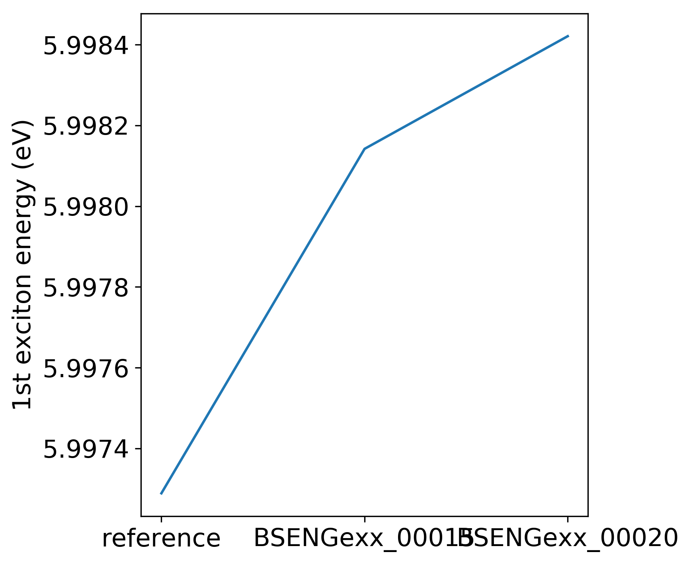

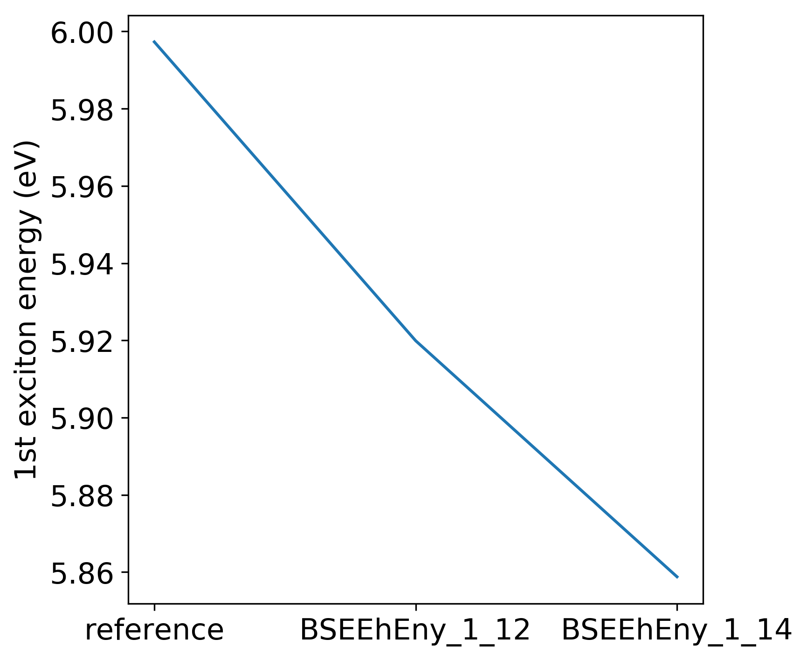

2. Coulomb truncation convergence
~~~~~~~~~~~~~~~~~~~~~~~~~~~~~~~~~~~~~~~~~~~~

Here we will check how the dielectric screening changes with vacuum spacing between layers and including a coulomb truncation technique.
For that we define a loop where we do a self-consistent ground state calculation, non self-consistent calculation, create the databases and run a ``yambo`` BSE calculation for different vacuum spacings.

To analyze the data we will:

    1. plot the dielectric screening

    2. check how the different values of the screening change the absorption spectra

In the folder ``tutorials/bn/`` you find the python script ``bse_cutoff.py``.
This script takes some time to be executed, you can run both variants without the cutoff and with the cutoff ``-c`` simultaneously to save time.
You can run this script with:

.. code-block:: bash

    python bse_cutoff.py -r -t4    # without coulomb cutoff
    python bse_cutoff.py -r -c -t4 # with coulomb cutoff

where ``-t`` specifies the number of MPI threads to use.
The main loop changes the ``layer_separation`` variable using values from a list in the header of the file.
In the script you can find how the functions ``scf``, ``ncf`` and ``database`` are defined.

**3. Plot the dielectric function**

In a similar way as what was done before we can now plot the dielectric function for different layer separations:

.. code-block:: bash

   yambopy plotem1s bse_cutoff/*/*     # without coulomb cutoff  
   yambopy plotem1s bse_cutoff_cut/*/* # with coulomb cutoff

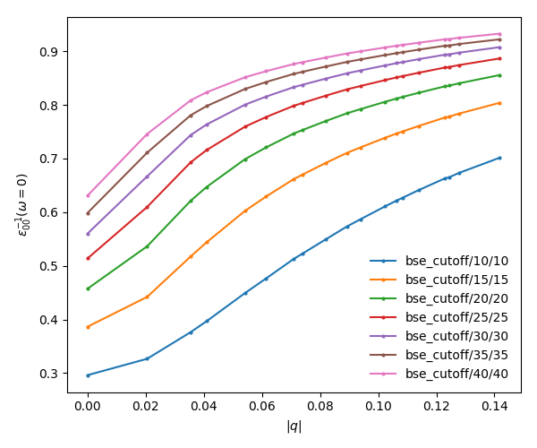

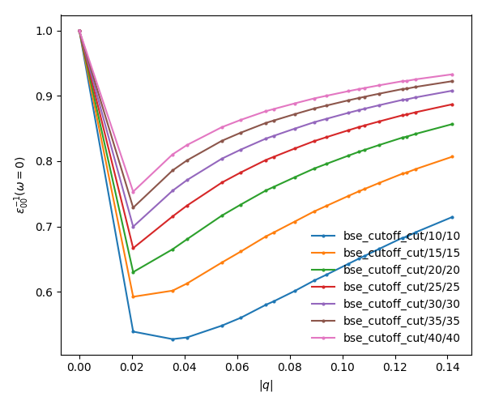

In these figures it is clear that the long-range part of the coulomb interaction (q=0 in reciprocal space) is truncated, i. e. it is forced to go to zero.

**2. Plot the absorption**

You can also plot how the absorption spectra changes with the cutoff using:

.. code-block:: bash

    python bse_cutoff.py -p
    python bse_cutoff.py -p -c

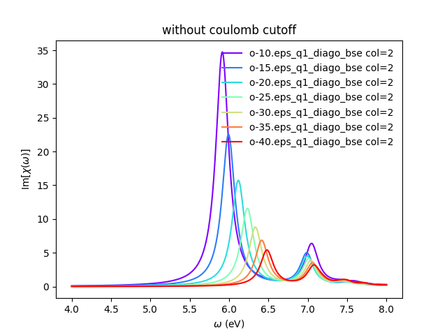

As you can see, the spectra is still changing with the vaccum spacing, you should 
increase the vacuum until convergence. For that you can add larger values to the ``layer_separations`` list and run the calculations and analysis again.

3. Excitonic wavefunctions
~~~~~~~~~~~~~~~~~~~~~~~~~~~~~~~~~~~~~~~~~~~~

In this example we show how to use the ``yambopy`` to plot the excitonic wavefunctions that result from a BSE calculation. The script we will use this time is: ``bse_bn.py``.
Be aware the parameters specified for the calculation are not high enough to obtain a converged result.
To run the BSE calculation do:

.. code-block:: bash

    python bse_bn.py -r

Afterwards you can run a basic analysis of the excitonic states and store the wavefunctions of the ones 
that are more optically active and plot their wavefunctions in reciprocal space.
Plots in real space are also possible using yambopy (by calling ypp). In the analysis code you have:

.. code-block:: python

    #get the absorption spectra
    #'yambo' -> was the jobstring '-J' used when running yambo
    #'bse'   -> folder where the job was run
    a = YamboBSEAbsorptionSpectra('yambo',path='bse')

    # Here we choose which excitons to read
    # min_intensity -> choose the excitons that have at least this intensity
    # max_energy    -> choose excitons with energy lower than this
    # Degen_Step    -> take only excitons that have energies more different than Degen_Step
    excitons = a.get_excitons(min_intensity=0.001,max_energy=7,Degen_Step=0.01)

    # read the wavefunctions
    # Cells=[13,13,1]   #number of cell repetitions
    # Hole=[0,0,6+.5]   #position of the hole in cartesian coordinates (Bohr units)
    # FFTGvecs=10       #number of FFT vecs to use, larger makes the
    #                   #image smoother, but takes more time to plot
    a.get_wavefunctions(Degen_Step=0.01,repx=range(-1,2),repy=range(-1,2),repz=range(1),
                        Cells=[13,13,1],Hole=[0,0,6+.5], FFTGvecs=10,wf=True)

    a.write_json()
    
The class ``YamboBSEAbsorptionSpectra()`` reads the absorption spectra obtained with explicit diagonalization of the
BSE matrix. ``yambo`` if the ``job_string`` identifier used when running yambo, ``bse`` is the name of the folder where the job was run.
The function ``get_excitons()`` runs ``ypp`` to obtain the exitonic states and their intensities.
The function ``get_wavefunctions()`` also calls ``ypp`` and reads the
reciprocal (and optionally real space) space wavefunctions and finally we store all the data in a ``json`` file.

This file can then be easily plotted with another python script.
To run this part of the code you can do:

.. code-block:: bash

    python bse_bn.py -a  #this will generate absorptionspectra.json
    yambopy plotexcitons absorptionspectra.json #this will plot it
    
You can tune the parameters ``min_intensity`` and ``max_energy`` and obtain more or less excitons.
``Degen_Step`` is used to not consider excitons that are degenerate in energy. The reason is that when representing the excitonic wavefunction, degenerate states should be represented together. This value should in general be very small in order to not combine excitons that have energies close to each other but are not exactly degenerate.
You should then obtain plots similar (these ones were generated on a 30x30 k-point grid) to the figures presented here:

.. image:: figures/absorption_bn.png
   :height: 500px
   :width: 600 px

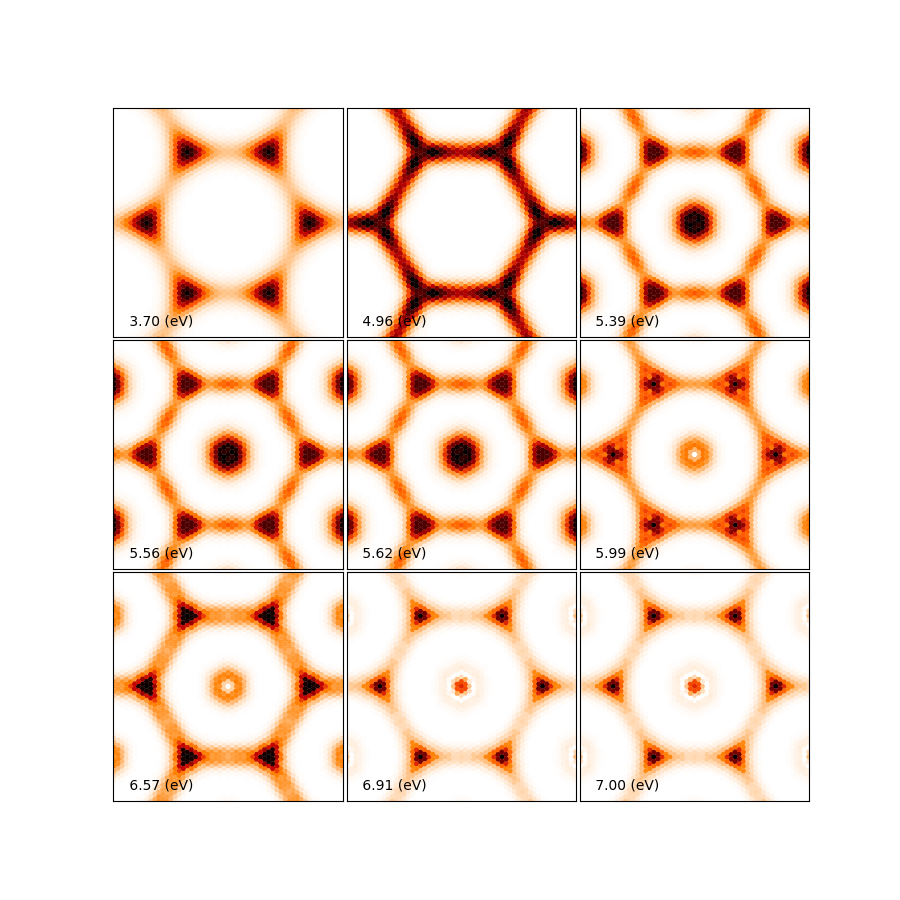

Again, be aware that this figures serve only to show the kind of representation 
that can be obtained with ``yambo``, ``ypp`` and ``yambopy``.
Further convergence tests need to be performed to obtain accurate results, but that is left to the user. You are invited to re-run the nscf loop with more k-points and represent the resulting
wavefunctions.

You can now visualize these wavefunctions in real space using our online tool:
`http://henriquemiranda.github.io/excitonwebsite/ <http://henriquemiranda.github.io/excitonwebsite/>`_ 

For that, go to the website, and in the ``Excitons`` section select ``absorptionspectra.json`` file using the ``Custom File``.
You should see on the right part the absorption spectra and on the left the representation of the wavefunction in real space.
Alternatively you can vizualize the individually generated ``.xsf`` files using xcrysden.

4. Parallel static screening
~~~~~~~~~~~~~~~~~~~~~~~~~~~~~~~~

In this tutorial we will show how you can split the calculation of the dielectric function in different jobs using ``yambopy``.
The dielectric function can then be used to calculate the excitonic states using the BSE.

The idea is that in certain clusters it is advantageous to split the jobs as much as possible.
The dielectric function is calculated for different momentum transfer (q-points) over the brillouin zone.
Each calculation is independent and can run at the same time.
Using the ``yambo`` parallelization you can separate the dielectric function calculation among many cpus
using the variable ``q`` in ``X_all_q_CPU`` and ``X_all_q_ROLEs``. The issue is that you still need to make a big reservation
and in some cases there is load imbalance (some nodes end up waiting for others). Splitting in smaller jobs
can help your jobs to get ahead in the queue and avoid the load imbalance.
If there are many free nodes you might end up running all the q-points at the same time.

**The idea is quite simple:** you create an individual input file for each q-point, submit each job separately, collect
the results and do the final BSE step (this method should also apply for a GW calculation).

**2. Parallel Dielectric function**

To run the dielectric function in parallel do:

.. code-block:: bash

    python bse_par_bn.py -r -t2

Here we tell ``yambo`` to calculate the dielectric function.
We read the number of q-points the system has and generate one input file per q-point.
Next we tell ``yambo`` to calculate the first q-point.
``yambo`` will calculate the dipoles and the dielectric function at the first q-point.
Once the calculation is done we copy the dipoles to the SAVE directory. After that we run each q-point calculation as a separate job.
Here the user can decide to submit one job per q-point on a cluster or use the python ``multiprocessing`` module to submit the jobs in parallel.
In this example we use the second option.

.. code-block:: python

    from yambopy import *
    import os
    import multiprocessing

    yambo = "yambo"
    folder = "bse_par"
    nthreads = 2 #create two simultaneous jobs

    #create the yambo input file
    y = YamboIn('yambo -r -b -o b -V all',folder=folder)

    y['FFTGvecs'] = [30,'Ry']
    y['NGsBlkXs'] = [1,'Ry']
    y['BndsRnXs'] = [[1,30],'']
    y.write('%s/yambo_run.in'%folder)

    #get the number of q-points
    startk,endk = map(int,y['QpntsRXs'][0])

    #prepare the q-points input files
    jobs = []
    for nk in xrange(1,endk+1):
        y['QpntsRXs'] = [[nk,nk],'']
        y.write('%s/yambo_q%d.in'%(folder,nk))
        if nk != 1:
            jobs.append('cd %s; %s -F yambo_q%d.in -J yambo_q%d -C yambo_q%d 2> log%d'%(folder,yambo,nk,nk,nk,nk))

    #calculate first q-point and dipoles
    os.system('cd %s; %s -F yambo_q1.in -J yambo_q1 -C yambo_q1'%(folder,yambo))
    #copy dipoles to save
    os.system('cp %s/yambo_q1/ndb.dip* %s/SAVE'%(folder,folder))

    p = multiprocessing.Pool(nthreads)
    p.map(run_job, jobs)

**3. BSE**

Once the dielectric function is calculated, it is time to collect the data in one folder and
do the last step of the calculation: generate the BSE Hamiltonian, diagonalize it and
calculate the absorption.

.. code-block:: python

    #gather all the files
    if not os.path.isdir('%s/yambo'%folder):
        os.mkdir('%s/yambo'%folder)
    os.system('cp %s/yambo_q1/ndb.em* %s/yambo'%(folder,folder))
    os.system('cp %s/*/ndb.em*_fragment* %s/yambo'%(folder,folder))

    y = YamboIn('yambo -r -b -o b -k sex -y d -V all',folder=folder)
    y['FFTGvecs'] = [30,'Ry']
    y['NGsBlkXs'] = [1,'Ry']
    y['BndsRnXs'] = [[1,30],'']
    y['BSEBands'] = [[3,6],'']
    y['BEnSteps'] = [500,'']
    y['BEnRange'] = [[0.0,10.0],'eV']
    y['KfnQP_E']  = [2.91355133,1.0,1.0] #some scissor shift
    y.arguments.append('WRbsWF')
    y.write('%s/yambo_run.in'%folder)

    print('running yambo')
    os.system('cd %s; %s -F yambo_run.in -J yambo'%(folder,yambo))

**3. Collect and plot the results**

You can then plot the data as before:

.. code-block:: bash
      
    python bse_par_bn.py -p

This will execute the following code:

.. code-block:: python

    #collect the data
    pack_files_in_folder('bse_par')

    #plot the results using yambo analyser
    y = YamboAnalyser()
    print y
    y.plot_bse(['eps','diago'])

You should obtain a plot like this:

.. image:: figures/bse_bn.png

5. Computing exciton lifetimes
~~~~~~~~~~~~~~~~~~~~~~~~~~~~~~~~
In this tutorial you will learn how to compute the exciton radiative lifetimes.
Note, that you need to perform a BSE calculation first and have access to the residuals of the BSE run.
The exciton lifetimes at 0 K can be computed according to the formula given Equation 2 `chen2018`_. 
Note that here we compute the :math:`q\rightarrow 0` limit.

First initialize the `YamboExcitonDB` database:

.. code-block:: python

	yexc = YamboExcitonDB.from_db_file(ylat,folder = bse_path, filename='ndb.BS_diago_Q1')

where `bse_path` is the path to the `ndb.BS_diago_Q1` database.

Then create an instance of the `ExcitonLifetimes` class and call its method.

.. code-block:: python

	lifetime_obj = ExcLifetimes(yexc) 
	excE, tau0_tot, merged_states = lifetime_obj.get_exciton_lifetimes(statelist=np.array([0,1,2,3,6,7]),verbosity=False,gauge='velocity')

`get_exciton_lifetimes` accept a list of states for which you would like to compute the exciton lifetimes. This list correspond to the poles of the BSE Hamiltonian and they are sorted by the exciton energy (increasing order). `tau0_tot` contains the lifetimes in `seconds`. The inverse of `tau0_tot` correspond to the radiative decay :math:`\gamma(0)`

.. _chen2018:
	https://pubs-acs-org.proxy.library.uu.nl/doi/full/10.1021/acs.nanolett.8b01114

