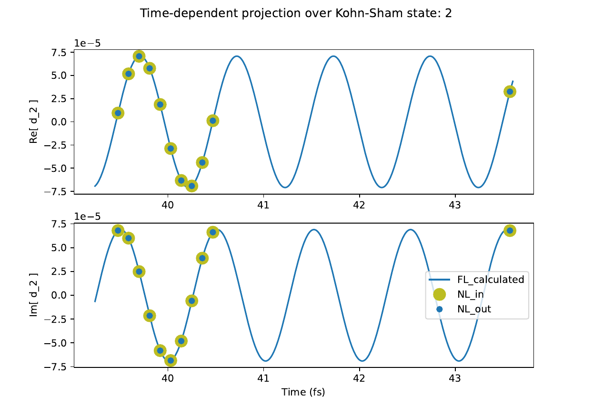
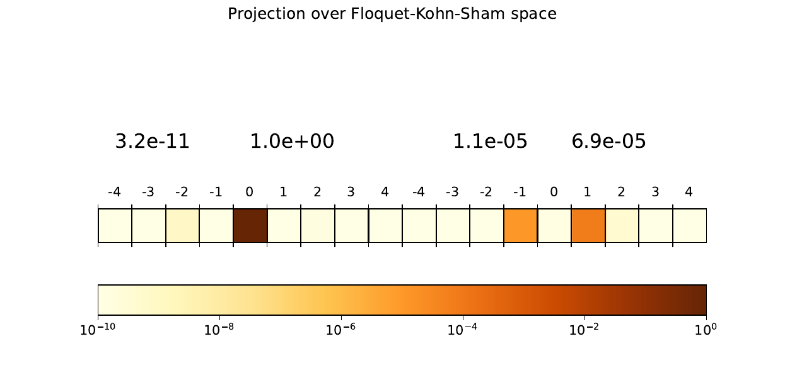
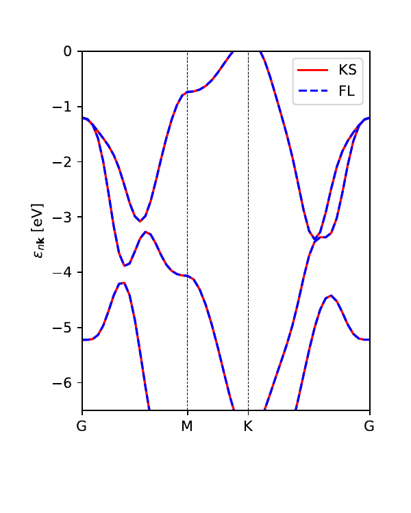
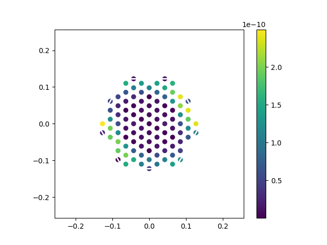

# Floquet Analysis of real-time simulations

#### Myrta Grüning and Ignacio M Alliati	

The Floquet analysis is following a real-time simulation of the nonlinear susceptibilities for a given material on a given frequency range. The analysis is performed on a single frequency of interest. If you want to analyse more frequencies, then the whole procedure must be repeated.

 The analysis proceeds in two steps:

1. The time-dependent Bloch-states are sampled at several times during the simulation and saved for later analysis. This part uses `yambo_nl`Note that this functionality is present only in the lumen fork.
2. From the sampled Bloch-states, Floquet quasi-energies and Floquet-Kohn-Sham (F-KS) coefficients are extracted (see theory for getting an understanding of the terminology and the extraction procedure). These quantities can then be used to e.g. plots the Floquet bands or perform an analysis of the states contributing to a given peak at different harmonic orders. At present this is implemented in the `fl-analysis` branch.  

*This tutorial uses the tutorial databases of 2D hBN for real-time simulations*. It is assumed that the setup and other preparatory calculations were run. Also, set up `$PATH_TO_TUTORIALS` and `$PATH_TO_EXEC` environment variables according to where you saved the tutorial databases and executable.

## 1. Calculation with yambo_nl: sampling of the TD Bloch-states

Change directory to `$PATH_TO_TUTORIALS/hBN-2D-RT/YAMBO/FixSymm/`

From the command line, type:
`$PATH_TO_EXEC/yambo_nl -nl p -V nl -F 01_Floquet_sample.in` 
This generate the input for the Bloch-states dynamics (`-nl`) in the "pump-probe" mode (`p`) in the verbose mode (`-V nl`). The input is saved in the text file `01_Floquet_sample.in`  

 For the purposes of this tutorial, edit the `01_Floquet_sample.in` to change the following variables:
`% NLBands`
  `4 |5 |                           # [NL] Bands range`
`%`
...
`Field1_Freq= 4.100000      eV    # [RT Field1] Frequency`
...
`% Field1_Dir`
 `1.000000 | 1.000000 | 0.000000 |        # [RT Field1] Versor`
`%`  

Finally change the key variable to perform a run that samples the TD Bloch states: 
`FLOrder=-4                # [NL] Fourier Order of Floquet Analysis`

if left to the default value (`-1` ), no database is created. A positive integer value, correspond to the harmonic order of the analysis. The harmonic order of analysis influences the number of times for which the time-dependent Bloch-states are sampled. In this case we choose `4`, that allows one to carry out the analysis up to the fourth order. 

This analysis can be performed only for monochromatic sources, so the only choices for the field kind are `SIN` and `SOFTSIN`. This is already set correctly from default.
Note it is important *not* to change the simulation time from its default (`-1.0`) but if you are experienced in such calculations. When the dfault is set, the code computes internally the minimum simulation time needed to sample the TD Bloch-states. If the simulation time is changed and it is not long enough, the code does proceed with the simulation but does not sample the Bloch-states.

When the input is created and the relevant variables set to their values, from the command line, type:
`$PATH_TO_EXEC/yambo_nl -F 01_Floquet_sample.in -J fl_sample`
This starts the simulation. The relevant database is saved in `fl_sample`directory.
When completed,  type `$ ls fl_sample/`, which should return
`ndb.dipoles    ndb.Nonlinear_fragment_1  ndb.RT_V_bands`
`ndb.Nonlinear  ndb.RT_OBSERVABLES        ndb.RT_V_bands_K_section`
The relevant databases are `ndb.RT_V_bands*`. 
By typing
`ncdump fl_sample/ndb.RT_V_bands`
the content of the database is dumped to human readable output. You can verify indeed that the harmonic order for the analysis is set to 4 (` IO_Floquet_order = 4`) and that the Bloch states were sampled at the following 11 times (ignoring time 0)  in atomic units:
` IO_TIME_points = ..., 1801.24363627398 ;
11 corresponds to `(4*2 + 1) + 2` where `9`points are needed to extract the F-KS coefficients up to the fourth harmonic order and the extra `2` points are used to determine the phase of Bloch-states which corresponds to the Floquet quasienergy. The second file `ndb.RT_V_bands_K_section` contains the sampled TD Bloch-states. 

## 2. Analysis with yambo.py

### 2.1 Extraction of quasienergies and F-KS coefficients

First, we load all needed modules. Then, we use the `YamboVbandsDB` class to read the information from the databases in  `fl_sample` and save them into the `mydb` object, which we then print:

```python
from netCDF4 import Dataset
from yambopy import YamboVbandsDB, VbPP
calc='fl_sample'
mydb=YamboVbandsDB(calc=calc)
print(mydb)
```
this returns the key parameters encoded in the object:
```

 * * * ndb.V_bands dbs data * * * 

N timesteps   : 12
Basis size    : 2
Basis index   : [4, 5]
Number Kpt    : 100
Number Vbands : 4
Floquet order : 4
```
then, for a given Bloch (identified by the the band and kpoint index), we create, by using the `VbPP` class, the object that contains the Bloch state corfficients with other information extracted from other databases and the parameters for the algorithm which extracts the Floquet coefficients. When not specified, the defaults are used.     

```python
kpt,band = 6,4
vbs = VbPP(mydb,kpt,band)
print(vbs)
```
this returns:
```
 * * * Vbands PP class  * * * 

Selected Kpt  : 6
Selected Band : 4
KS energy     : -0.7363796917129902 [eV]
Basis index   : [4, 5]

 =================================

Field freq    : 4.1 [eV] 
Field period  : 1.0086993327424623 [fs] 

 =================================

QEnergy thrsh : 1e-07
Error thrsh   : 1e-08
Conv step     : 0.01
Max iteration : 300

 =================================

Max Floq mode : 4
Tot Floq modes: 9

 =================================

Time: 39.48 fs:
bnd   c.real             c.imag
4   0.9827887533930595   0.1847329333754098
5   -3.2704498215768856e-06   6.860737302506322e-05
...
```
Finally, we use the  `find_qe` method to obtain the Floquet quasienergies and coefficients for the given state. We then print and plot information of the extraction procedure and results.   
```python
  optimized_evecs = vbs.find_qe()
  print(f'QE= {optimized_evecs.FL_qe} eV with accuracy {optimized_evecs.nr_acc} eV after {optimized_evecs.nr_it} iterations - error in periodicity = {optimized_evecs.err}')
  optimized_evecs.plot_realtime(band_to_plot=1,t_step=0.004)
  optimized_evecs.plot_floquet()
  optimized_evecs.output()
```
The print statement gives the value of the quasienergy (`QE`) and the accuracy/erro/iternationsr of the algorithm.  
`QE= -0.7363720804263066 eV with accuracy 2.277656729887667e-09 eV after 4 iterations - error in periodicity = 1.972764563161435e-09`
Further, it produces a folder `figs-TIMESTAMP_iterN/` containing

- `fig-FKS_projection.pdf` from the  `plot_floquet` method,                    
- `fig-real_time_projection_over_KS_state_2.pdf` from the `plot_realtime`method, where we specified `band_to_plot=1` which plot the second band in the basis 
- `output-TIMESTAMP_iterN.dat`from the `output` method

The `fig-real_time_projection_over_KS_state_2.pdf` shows the points sampled in the NL run, those calculated by the algorithm and the TD behaviour of the reconstructed Bloch state 



The `fig-FKS_projection.pdf` shows for  $\bf k$ index = 6 and band index $n=$4, the $d_{{\bf k}ni}(\eta)$ for $i=4,5$ and $\eta = -4,\dots,4$. One can see that most of the weight is still on the ground state $i=4, \eta = 0$, with linear response components ($i= 5, \eta = \pm 1$) of the order of $10^{-5}$ and very small nonlinear components.  




### 2.2 Plot of the Floquet bands

While the previous example helps to see how the procedure work, usually we want all states. This allows for instance to plot the Floquet bands. As before, we import all needed functions and classes:
```python
from netCDF4 import Dataset
from yambopy import YamboVbandsDB, YamboLatticeDB, findallk_qe, calc_rho, plot_2D_kdist,get_qebands_path, get_qebands_interpolate
from qepy.lattice import Path
import numpy as np
import matplotlib.pyplot as plt
```
Then, we read the relevant databases as in the previous example, This time we use the `findallk_qe` auxiliary function that for all states repeat the procedure above of finding the quasienergies and coefficients. 
```python
calc='fl_sample'  # name of the directory containing the relevant DBs 
mydb=YamboVbandsDB(calc=calc)
fl_eignvectors, fl_quasienergy, ks_eigenvalues = findallk_qe(mydb,report_file='results_eval.dat')
```
It outputs the coefficients, the quasienergies and KS energies which we pass to the variables `fl_eignvectors, fl_quasienergy, ks_eigenvalues`. It also write the quasi- and KS-energies together with the accuracy/error/iteration of the procedure for all states.  

To plot the bandstructure, we define the path along the high symmetry points and the number of divisions:
```python
npoints = 10  # number of divisions
path = Path([ [[  0.0,  0.0,  0.0],'G'],  # path along the BZ
              [[  0.5,  0.0,  0.0],'M'],
              [[1./3.,1./3.,  0.0],'K'],
              [[  0.0,  0.0,  0.0],'G']], [int(npoints*2),int(npoints),int(np.sqrt(5)*npoints)] )
```

then we use `get_qebands_interpolate` to get the Floquet band structure along that path and finally plot the results:

```python
lat = YamboLatticeDB.from_db_file(filename='SAVE/ns.db1',Expand=False)
ks_bs, fl_bs = get_qebands_interpolate(lat,path,fl_quasienergy, ks_eigenvalues)
fig = plt.figure(figsize=(4,5))
ax = fig.add_axes( [ 0.20, 0.20, 0.70, 0.70 ])
ks_bs.plot_ax(ax,legend=True,c_bands='r',ylim=(-6.5,0.0),label='KS')
fl_bs.plot_ax(ax,legend=True,c_bands='b',linestyle= 'dashed',ylim=(-6.5,0.0),label='FL')
plt.savefig('QE_band_interp.pdf')
plt.close()
```

The standard output reports messages from the fit procedure:

```   
Found 2 symmetries in point group
rmax [7 7 7] msize: 3375
gen points 0.006451129913330078
...
```

Since the field is weak, the quasi- and KS-energies are indistinguishable:



### 2.3 Plot of the F-KS coefficients in the Brillouin zone

We can use a similar procedure to plot the F-KS coefficients $|d_{{\bf k}ni}(\eta)|$ (specifying the $n$ and $i$ indexes) for all $\bf k$ in the Brillouin zone and then plot the results   

```python
from netCDF4 import Dataset
from yambopy import YamboVbandsDB, YamboLatticeDB, findallk_qe, plot_2D_kdist
from qepy.lattice import Path
import numpy as np
import matplotlib.pyplot as plt
#
calc='fl_sample'
mydb=YamboVbandsDB(calc=calc)
fl_eignvectors, fl_quasienergy, ks_eigenvalues = findallk_qe(mydb,report_file='results_eval.dat')
#
lat = YamboLatticeDB.from_db_file(filename='SAVE/ns.db1',Expand=False)
floq_mode, bnd_1, bnd_2 = 2,4,5
floq_vbnd = bnd_1 - 1 
floq_cbnd = bnd_2 -  mydb.basis_index[0]
#
data = np.zeros([mydb.n_kpts])
data = np.absolute(fl_eignvectors[:,floq_vbnd,floq_mode,floq_cbnd])
#
kdist = plot_2D_kdist(data,lat,nspin=-1,plt_cbar=True,shift_BZ=False)

```

which shows the values of the $|d_{{\bf k}ni}(\eta)|$ on the BZ for $\eta =2$ and $ni = 4,5$: 




